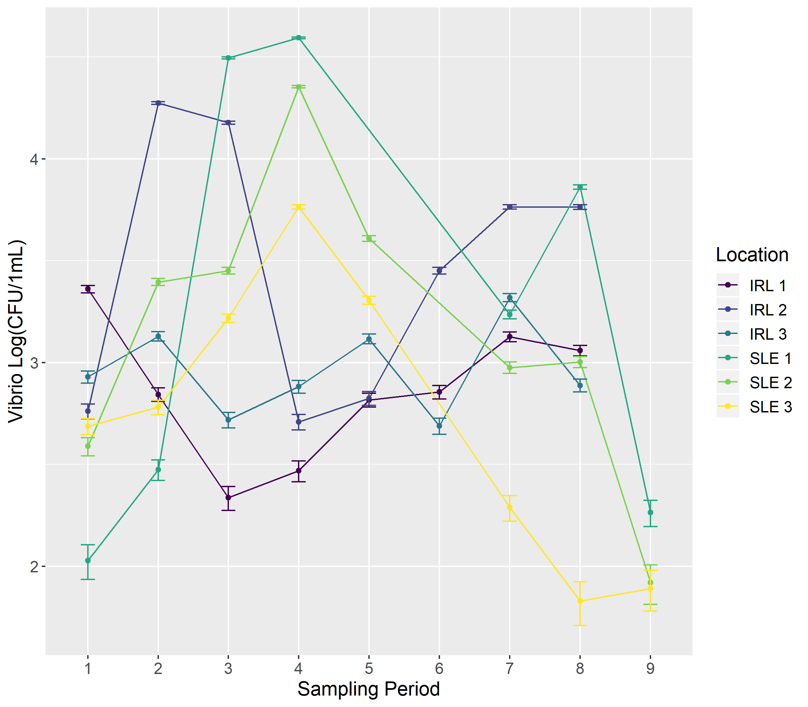
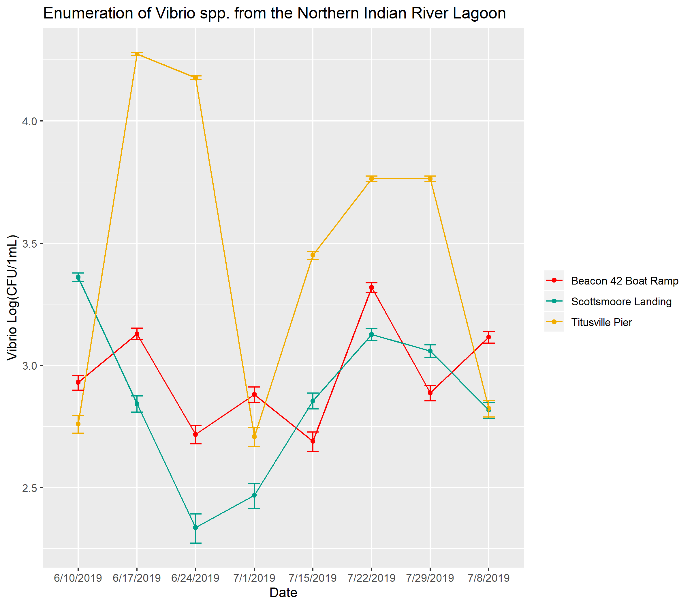
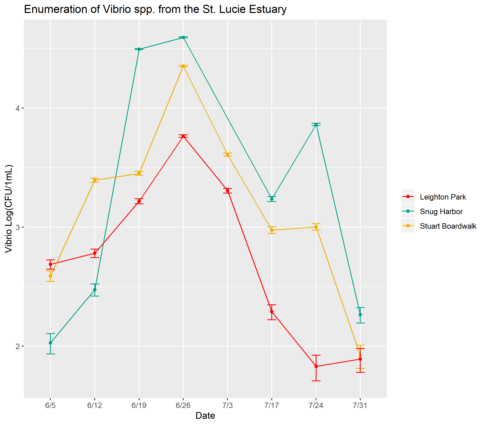
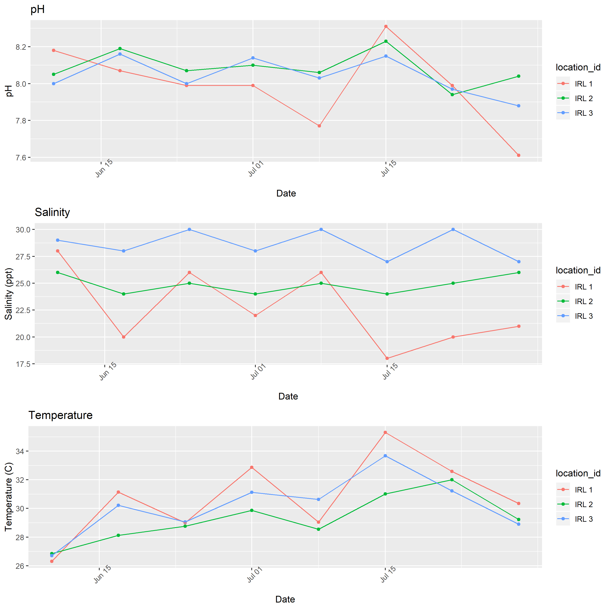
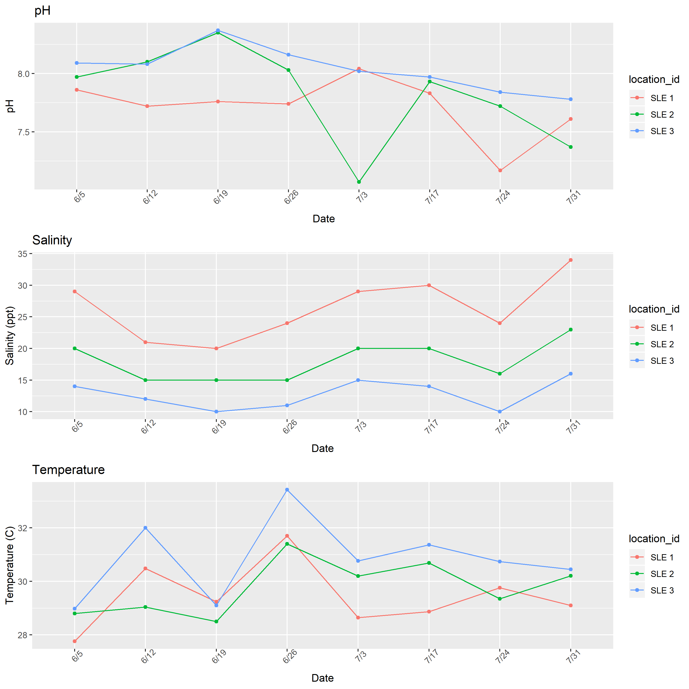
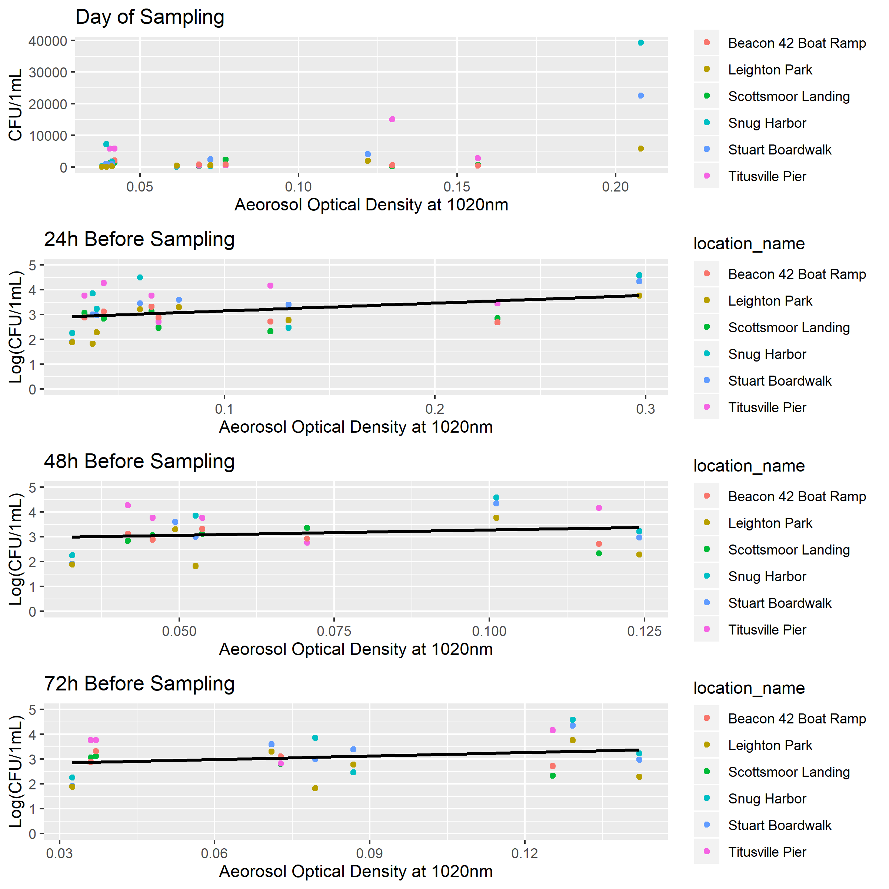
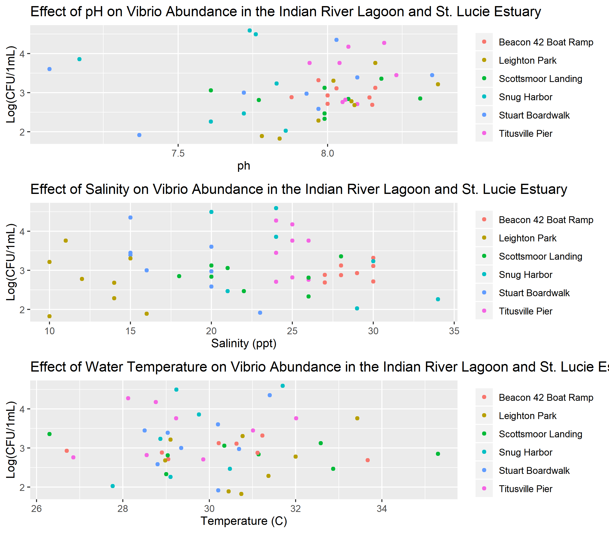
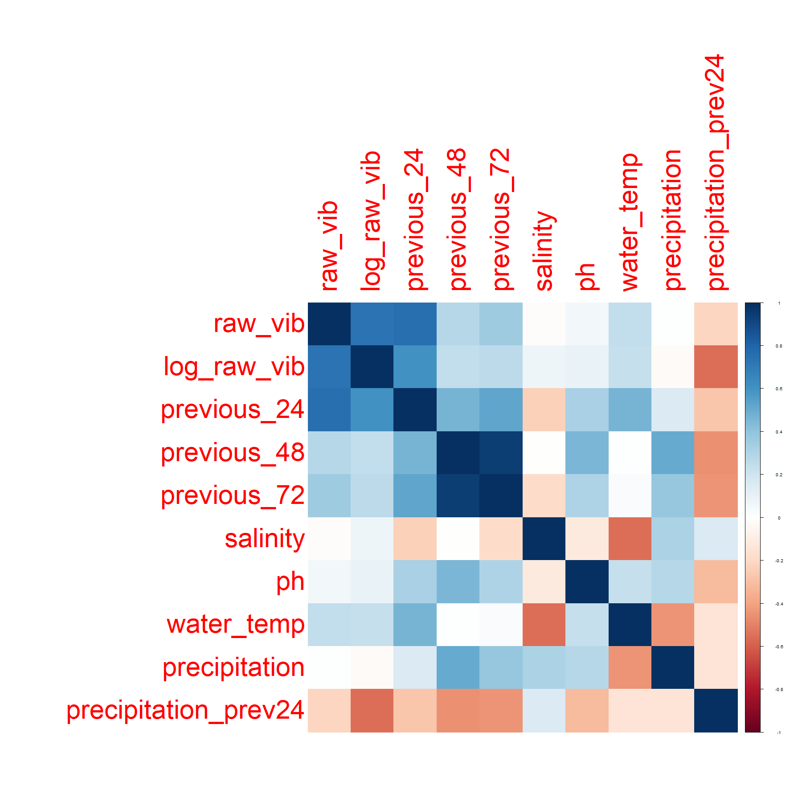

# Summary/Abstract
Harmful Algal Blooms (HABs) are an emerging concern for ecosystem and human health. Little is known about the influence of these HAB events on Vibrio dynamics in Florida’s estuaries. The “Omics” revolution has improved the resolution and scale by which researchers investigate the complex interactions between Vibrio bacteria and algae in natural waters. Through a genomics approach, this study examines the dynamics between Vibrio populations and harmful algal blooms in Florida’s Indian River Lagoon system. Surface water samples were collected from the Northern Indian River and St. Lucie Estuary weekly between June and July 2019. Samples were size fractionated to separate particle-attached and planktonic Vibrio bacteria. From each fraction, Vibrio abundance was estimated by culture-based methods as well as quantitate PCR (qPCR), targeting the RNA polymerase subunit A (rpoA). The abundance of phytoplankton was determined by flow cytometry. To characterize the species-specific associations between Vibrio and phytoplankton, the Vibrio hsp60 gene was amplified and sequenced from each fraction. This research demonstrates the correlations between Vibrio and phytoplankton abundance, while providing improved resolution of Vibrio assemblages associated with microalgae. By investigating bacterial-algal interactions, we may improve our understanding of how HAB events shape Vibrio ecology and microbial health risks.


# Introduction 

## General Background Information

Bacteria are increasingly recognized for their role in modulating harmful algal blooms (HABs) [REF]. In turn, algal blooms have been found to stimulate microbial activity of the aquatic bacterial community, including pathogenic bacteria [REF]. 

Vibrio spp. are a group of human pathogenic bacteria that are ubiquitous in estuary and marine environments. Vibrio illnesses are typically associated with the consumption of contaminated water and seafood, or with the infection of exposed wounds. V. vulnificus infection is the leading cause of seafood-borne deaths in the United States, usually the infection of exposed wounds by contaminated waters. 

Research has demonstrated that the distribution and dynamics of Vibrio populations are heavily influenced by environmental factors and that Vibrio abundance increases during algal blooms [REF]. Rapid algal growth may provide substrates and surfaces that stimulate Vibrio growth. Phytoplankton blooms may influence Vibrio ecology. In turn, Vibrio blooms may pose health risks to local populations.

Investigating bacterial-algal interactions improves our understanding how HAB events shape microbial health risks. 

Our research is conducted along Florida’s Indian River Lagoon (IRL), which stretches along Florida’s east coast. The IRL is an estuary of national significance and is protected by the USA National Estuaries Program. In recent years, the IRL has suffered from dense and damaging algal blooms, including those caused by the novel brown tide algae Aureoumbra lagunensis and by the toxic blue-green algae Microcystis aeruginosa. Our research aims to investigate the interactions between bacteria and harmful algae during these HAB events. 

We aimed to observe these dynamics during the summer of 2019. During this period, **we did not observe an algal bloom** at our field site. **but** we did collect a wealth of data on Vibrio populations and environemntal variables. I am hoping to use this project as an opportunity to examine our data with these variables. With a reproducible analysis, I am hopeful that we can collect and analyze our data when a bloom event arises.    

## Description of data and data source

The primary data shared here was collected during our 2019 field season. During this field season, surface water samples were collected from the Northern Indian River Lagoon and the St. Lucie Estuary, along Florida's eastern coast. Weekly samples were collected between June 5, 2019 and July 30, 2019. Environemntal variables were measured at the time of sampling. Samples were processed to enumerate Vibrio bacteria from water samples. 

We will also include here environmental variables measured or predicted by other agencies. This data includes information on aerosol deposition (dust data), precipitation, and surface water flow. 

## Questions/Hypotheses to be addressed

Broadly, we aim to examine the associations between Vibrio spp. and harfmul algal species during the succession of a bloom event. We ask: do harmful algal blooms promote Vibrio growth during a bloom event? We hypothesize that Vibrio populations will increase during brown tide blooms. The ecology of these two organisms are similar (they both thrive in warm, salty waters). In contrast, we predict that Vibrio populations will decrease during the toxic blue-green algae blooms caused by Microcystis aeruginosa. Microcystis thrives in freshwaters and produces a harmful toxin that may damage Vibrio bacteria. 

We're still keeping a watchful eye for an alagl bloom back in Florida, but until then, we hope to ask more exploratory questions to see if there are trends or relationships between Vibrio bacteria and other environmental variables. 

In this analysis, we ask: how do environemntal conditions influence Vibrio populations in Florida's Indian River Lagoon? Can the patterns in our Vibrio data be explained by salinity, pH, water temperature, precipitation, or aerosol deposition? We predict that Vibrio populations increase with warmer temperatures and with salinity. 

During this field season, there was a notable "dust event," where Saharan Dust was transported across the Atlantic to Florida's coast. This dust may provide nutrients for rapid Vibrio growth. Are there associations between the dust patterns and Vibrio populations? 

# Methods

Water samples were collected in triplicate from three locations in both the Northern Indian River Lagoon and the St. Lucie Estuary. Samples were collected weekly between June 2019 and July 2019 to monitor phytoplankton and Vibrio abundance (n = 144). 

Water samples were pre-filtered using a sterilized 200-µm filter to remove debris, detritus, and zooplankton. Physical parameters of the sampling sites were measured in-field using a YSI sonde. Salinity was determined using a refractometer. Data was collected on site at the time of sampling. Water samples will be analyzed for Chl a and nutrient composition. Water quality will be cross-referenced with the Continuous Sensor-based Water Quality Data from St. John’s Water Management District. 

Samples were plated onto TCBS to culture and enumerate Vibrio bacteria. Cell density of phytoplankton will be determined from fixed samples using direct counts and flow cytometry.

Water samples were size fractionated in series onto polycarbonate filters (2.0 µm) and Sterivex filters (0.22 µm) to seperate the particle-attached and planktonic bacterial communities. DNA will be extracted from stored filters using the Qiagen PowerSoil Pro Kit and phenol:chloroform:isoamyl extractions. Bacterial and phytoplankton DNA will be sequenced to characterize the aquatic microbial community.

Bacterial and cyanobacterial 16S rRNA will be amplified using universal 16S primers 515F/806R [REF]. Novel NGS sequencing of the Vibrio heat shock  protein 60 (hsp60) will be sequenced as described in Jesser and Noble 2018 to provide additional taxonomic resolution of the Vibrio community. 18S rRNA will be amplified using the universal 18S primers EukA/329R10 as described in Torre et al. 2019 to analyze the phytoplankton community. 


## Data Aquisition

Daily averages for aerosol optical depth (AOD) were obtained from [AERONET Version 3](https://aeronet.gsfc.nasa.gov/new_web/data.html). The AOD values were obtained for stations at NASA Kennedy Space Center and Lake Okeechobee to approximate the aerosol optical depth in the Northern Indian River Lagoon (IRL), and the St. Lucie Estuary (SLE), respectively. The following data are cloud cleared and quality controls have been applied but these data may not have final calibration applied. For more information on this data, contact: PI Nima_Pahlevan at nima.pahlevan@nasa.gov

## Data Import and Cleaning
The processing script provides code that imports and cleans the data included in this analysis. Water quality paramters and Vibrio counts were recorded as data was collected. Daily averages for aerosol optical depth (AOD) were obtained from [AERONET Version 3](https://aeronet.gsfc.nasa.gov/new_web/data.html) on 9/12/2019. 

#Results

## Univariate analysis

```{r fig.cap='Enumeration of Vibrio spp. from the Indian River Lagoon and St. Lucie Estuary. Samples were collected between June 5, 2019 and July 30, 2019.', echo=FALSE, warning=FALSE}

```


```{r fig.cap='Enumeration of Vibrio spp. from the Indian River Lagoon between June 5, 2019 and July 30, 2019.', echo=FALSE, warning=FALSE}

```


```{r fig.cap='Enumeration of Vibrio spp. from the St. Lucie Estuary between June 5, 2019 and July 30, 2019.', echo=FALSE, warning=FALSE}

```


```{r fig.cap = "Aerosol optical density (AOD at 1020nm) over time in the Indian River Lagoon and St. Lucie Estuary, as determined by Aeronet Stations at KSC and Lake Okechobee, respectively.", echo=FALSE, warning=FALSE}
knitr::include_graphics("../../results/dust_date.png")
```


```{r fig.cap = "Water quality parameters over time in the Indian River Lagoon as determined in field using refractometer and YSI sonde.", echo=FALSE, warning=FALSE}

```


```{r fig.cap= "Water quality parameters over time in the St. Lucie Estuary as determined in field using refractometer and YSI sonde.", echo=FALSE, warning=FALSE}

```


## Bivariate analysis

```{r fig.cap = "Enumeration of Vibrio spp. from the Indian River Lagoon and St. Lucy Estuary in relation to aerosol optical density (1020nm).", echo = FALSE, warning=FALSE}

```


```{r fig.cap = "Enumeration of Vibrio spp. from the Indian River Lagoon and St. Lucy Estuary in relation to water quality parameters.  Water quality parameters were determined in field using refractometer and YSI sonde.", echo = FALSE, warning=FALSE}

```


```{r fig.cap = "Correlation between environmental variables and Vibrio counts.", echo = FALSE, warning=FALSE}

```


## Full analysis

```{r simple linear model}
resulttable = readRDS("../../results/resulttable.rds")
knitr::kable(resulttable, caption = "Results of linear model fit to explain Vibrio counts.")
```


# Discussion

## Summary and Interpretation
_Summarize what you did, what you found and what it means._

## Strengths and Limitations
_Discuss what you perceive as strengths and limitations of your analysis._

## Conclusions
_What are the main take-home messages?_


_Include citations in your Rmd file using bibtex, the list of references will automatically be placed at the end_

# References

