# Summary/Abstract
Harmful Algal Blooms (HABs) are an emerging concern for ecosystem and human health. Little is known about the influence of these HAB events on _Vibrio_ dynamics in Florida’s estuaries. The “Omics” revolution has improved the resolution and scale by which researchers investigate the complex interactions between _Vibrio_ bacteria and algae in natural waters. Through a genomics approach, this study examines the dynamics between _Vibrio_ populations and harmful algal blooms in Florida’s Indian River Lagoon system. Surface water samples were collected from the Northern Indian River and St. Lucie Estuary weekly between June and July 2019. Samples were size fractionated to separate particle-attached and planktonic _Vibrio_ bacteria. From each fraction, _Vibrio_ abundance was estimated by culture-based methods as well as quantitate PCR (qPCR), targeting the RNA polymerase subunit A (rpoA). The abundance of phytoplankton was determined by flow cytometry. To characterize the species-specific associations between _Vibrio_ and phytoplankton, the _Vibrio_ hsp60 gene was amplified and sequenced from each fraction. This research demonstrates the correlations between _Vibrio_ and phytoplankton abundance, while providing improved resolution of _Vibrio_ assemblages associated with microalgae. By investigating bacterial-algal interactions, we may improve our understanding of how HAB events shape _Vibrio_ ecology and microbial health risks.


# Introduction 

## General Background Information

Harmful algal blooms (HABs) are an emerging global concern for ecosystem and public health. HAB events adversely affect water quality and deteriorate aquatic habitats. Contaminated waters pose public health risks, as HAB events may produce harmful toxins or promote the growth of pathogenic bacteria [@Kodama2006, @Kirkpatrick2016,@Grattan2016].

Bacteria are increasingly recognized for their role in modulating HAB bloom dynamics [@Kodama2006, @Zhou2018]. Similarly, algal blooms have been found to affect the activity of aquatic bacteria[REF]. 

_Vibrio_ spp. are a group of human pathogenic bacteria that are ubiquitous in estuary and marine environments. _Vibrio_ illnesses are typically associated with the consumption of contaminated water and seafood, or with the infection of exposed wounds. _V. vulnificus_ infection is the leading cause of seafood-borne deaths in the United States, usually the infection of exposed wounds by contaminated waters. Research has demonstrated that the distribution and dynamics of _Vibrio_ populations are influenced by algal dyanamics [REF].Rapid algal growth may provide substrates and surfaces that stimulate _Vibrio_ growth. 

Phytoplankton blooms may influence _Vibrio_ ecology. In turn, _Vibrio_ blooms may pose health risks to local populations.Investigating bacterial-algal interactions improves our understanding how HAB events shape microbial health risks. 

Our research investigates _Vibrio_ dynamics along Florida’s Indian River Lagoon (IRL), on Florida’s east coast. The IRL is an estuary of national significance and is protected by the USA National Estuaries Program. In recent years, the IRL has suffered from dense and damaging algal blooms, including those caused by the novel brown tide algae _Aureoumbra lagunensis_ and by the toxic blue-green algae _Microcystis aeruginosa_ [@Schaefer2019]. Our research aims to investigate the interactions between bacteria and harmful algae during these HAB events. 

We aimed to observe these dynamics during the summer of 2019. During this period, **we did not observe an algal bloom** at our field site. **but** we did collect a wealth of data on _Vibrio_ populations and environemntal variables. I am hoping to use this project as an opportunity to examine our data with these variables. With a reproducible analysis, I am hopeful that we can collect and analyze our data when a bloom event arises.    

## Description of data and data source

The primary data shared here was collected during our 2019 field season. During this field season, surface water samples were collected from the Northern Indian River Lagoon and the St. Lucie Estuary, along Florida's eastern coast. Weekly samples were collected between June 5, 2019 and July 30, 2019. Environemntal variables were measured at the time of sampling. Samples were processed to enumerate _Vibrio_ bacteria from water samples. 

We will also include here environmental variables measured or predicted by other agencies. This data includes information on aerosol deposition (dust data), precipitation, and surface water flow. 

## Questions/Hypotheses to be addressed

Broadly, we aim to examine the associations between _Vibrio_ spp. and harfmul algal species during the succession of a bloom event. We ask: do harmful algal blooms promote _Vibrio_ growth during a bloom event? We hypothesize that _Vibrio_ populations will increase during brown tide blooms. The ecology of these two organisms are similar (they both thrive in warm, salty waters). In contrast, we predict that _Vibrio_ populations will decrease during the toxic blue-green algae blooms caused by Microcystis aeruginosa. Microcystis thrives in freshwaters and produces a harmful toxin that may damage _Vibrio_ bacteria. 

We're still keeping a watchful eye for an alagl bloom back in Florida, but until then, we hope to ask more exploratory questions to see if there are trends or relationships between _Vibrio_ bacteria and other environmental variables. 

In this analysis, we ask: how do environemntal conditions influence _Vibrio_ populations in Florida's Indian River Lagoon? Can the patterns in our _Vibrio_ data be explained by salinity, pH, water temperature, precipitation, or aerosol deposition? We predict that _Vibrio_ populations increase with warmer temperatures and with salinity. 

During this field season, there was a notable "dust event," where Saharan Dust was transported across the Atlantic to Florida's coast. This dust may provide nutrients for rapid _Vibrio_ growth. Are there associations between the dust patterns and _Vibrio_ populations? 

# Methods

Water samples were collected in triplicate from three locations in both the Northern Indian River Lagoon and the St. Lucie Estuary. Samples were collected weekly between June 2019 and July 2019 to monitor phytoplankton and _Vibrio_ abundance (n = 144). 

In the Northern Indian River Lagoon (IRL), samples were collected from three locations: Scottsmoor Landing (IRL 1), Titusville Pier (IRL 2), and the Beacon 42 Boatramp (IRL 3). Samples were collected on the following dates: 6/10, 6/17, 6/24, 7/1, 7/8, 7/15, 7/22, 7/29. The NIRL is not heavily influenced by tidal mixing. 

In the St. Lucie Estuary (SLE), samples were collected from three locations: Snug Harbor Yacht Club (SLE 1), Stuart Boardwalk (SLE 2), and Leighton Park (SLE 3). Samples were collected on the following dates: 6/5, 6/12, 6/19, 6/26, 7/3,  7/17, 7/24, 7/31. The SLE is tidally influenced. Samples were collected during the outgoing tide. 

Water samples were pre-filtered using a sterilized 200-µm filter to remove debris, detritus, and zooplankton. Physical parameters of the sampling sites were measured in-field using a YSI sonde. Salinity was determined using a refractometer. Data was collected on site at the time of sampling. Water samples will be analyzed for Chl a and nutrient composition. Water quality will be cross-referenced with the Continuous Sensor-based Water Quality Data from St. John’s Water Management District. 

Samples were plated onto TCBS to culture and enumerate _Vibrio_ bacteria. Cell density of phytoplankton will be determined from fixed samples using direct counts and flow cytometry.

Water samples were size fractionated in series onto polycarbonate filters (2.0 µm) and Sterivex filters (0.22 µm) to seperate the particle-attached and planktonic bacterial communities. DNA will be extracted from stored filters using the Qiagen PowerSoil Pro Kit and phenol:chloroform:isoamyl extractions. Bacterial and phytoplankton DNA will be sequenced to characterize the aquatic microbial community.

Bacterial and cyanobacterial 16S rRNA will be amplified using universal 16S primers 515F/806R [REF]. Novel NGS sequencing of the _Vibrio_ heat shock  protein 60 (hsp60) will be sequenced as described in Jesser and Noble 2018 to provide additional taxonomic resolution of the _Vibrio_ community. 18S rRNA will be amplified using the universal 18S primers EukA/329R10 as described in Torre et al. 2019 to analyze the phytoplankton community. 


## Data Aquisition

Daily averages for aerosol optical depth (AOD) were obtained from [AERONET Version 3](https://aeronet.gsfc.nasa.gov/new_web/data.html). The AOD values were obtained for stations at NASA Kennedy Space Center and Lake Okeechobee to approximate the aerosol optical depth in the Northern Indian River Lagoon (IRL), and the St. Lucie Estuary (SLE), respectively. The following data are cloud cleared and quality controls have been applied but these data may not have final calibration applied. For more information on this data, contact: PI Nima_Pahlevan at nima.pahlevan@nasa.gov

## Data Import and Cleaning
The processing script provides code that imports and cleans the data included in this analysis. Water quality paramters and _Vibrio_ counts were recorded as data was collected. Daily averages for aerosol optical depth (AOD) were obtained from [AERONET Version 3](https://aeronet.gsfc.nasa.gov/new_web/data.html) on 9/12/2019. 

#Results

## Univariate Analysis

In this analysis, we aim to explain _Vibrio_ ecology in relation to environmental factors. __Vibrio__ was enumerated from two estuaries on Florida's east coast, over a period of eight weeks (\ref{fig:fig1}). 

```{r fig.cap='Enumeration of _Vibrio_ spp. from the Indian River Lagoon and St. Lucie Estuary. Samples were collected between June 5, 2019 and July 30, 2019. _Vibrio_ was enumerated on TCBS plates.', echo=FALSE, warning=FALSE}
knitr::include_graphics("../../results/all/all_Vibrio2.png")
```

### Indian River Lagoon 

In the IRL, _Vibrio_ abundance bloomed between June 17 and June 24, 2019 at the IRL 3 sampling location. During this bloom, the maximum _Vibrio_ abundance was recorded from the IRL, at 1.9 x 10^4 CFU/1mL. No bloom was obsered at the IRL 1 or IRL 2 locations during this time. In fact, the lowest _Vibrio_ abundance in the IRL was recorded at the IRL 2 location during this period, at 2.17 x 10^2 CFU/1mL on June 24, 2019. _Vibrio_ abundance increased again, at all three locations, on July 22, 2019.


```{r fig.cap = "Enumeration of _Vibrio_ spp. and environmental variables over time in the IRL. Water quality parameters salinity, pH, and water temperature were determined in field using refractometer and YSI sonde. Aerosol optical density (AOD at 1020nm) was determined by Aeronet Station at KSC.", echo=FALSE, warning=FALSE}
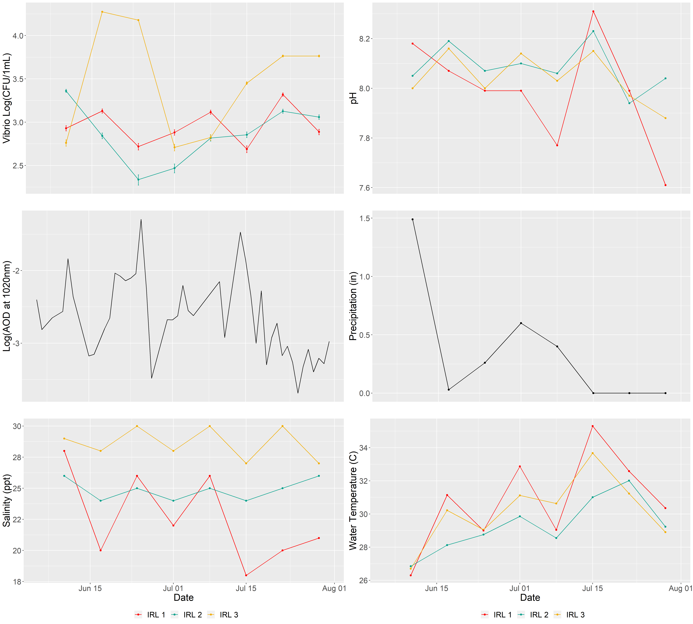
```

Upon visualization, the water quality parameters appeared to follow a distinct pattern of fluxuating conditions, as though they were tidally influenced; however, this estuary is not influenced by tidal mixing. Examining the time of sampling in the IRL, it appears that time of sample collection fluxuates in the same or similar pattern. 


```{r fig.cap= "Time of sample collection from IRL 1, IRL 2, and IRL 3 between June 10 and July 29, 2019.", echo=FALSE, warning=FALSE}
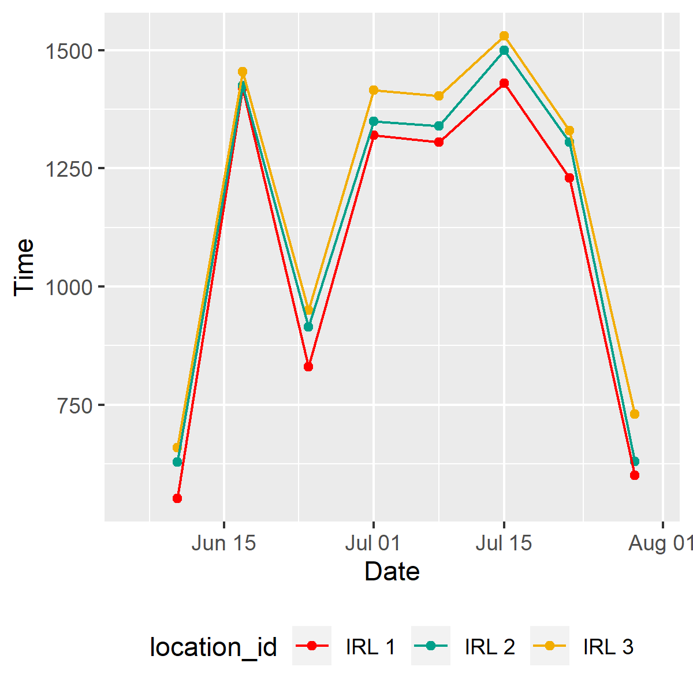
```

The peak in __Vibrio__ abundance appears to correspond with increases in AOD at 1020nm. Increases in AOD correspond with deposition of Saharan Dust. In the IRL, the AOD peaked on June 25, 2019 and again on July 14, 2019.


```{r fig.cap= "Abundance of Vibrio spp. and Aeorosol Optical Density in the IRL", echo=FALSE, warning=FALSE}
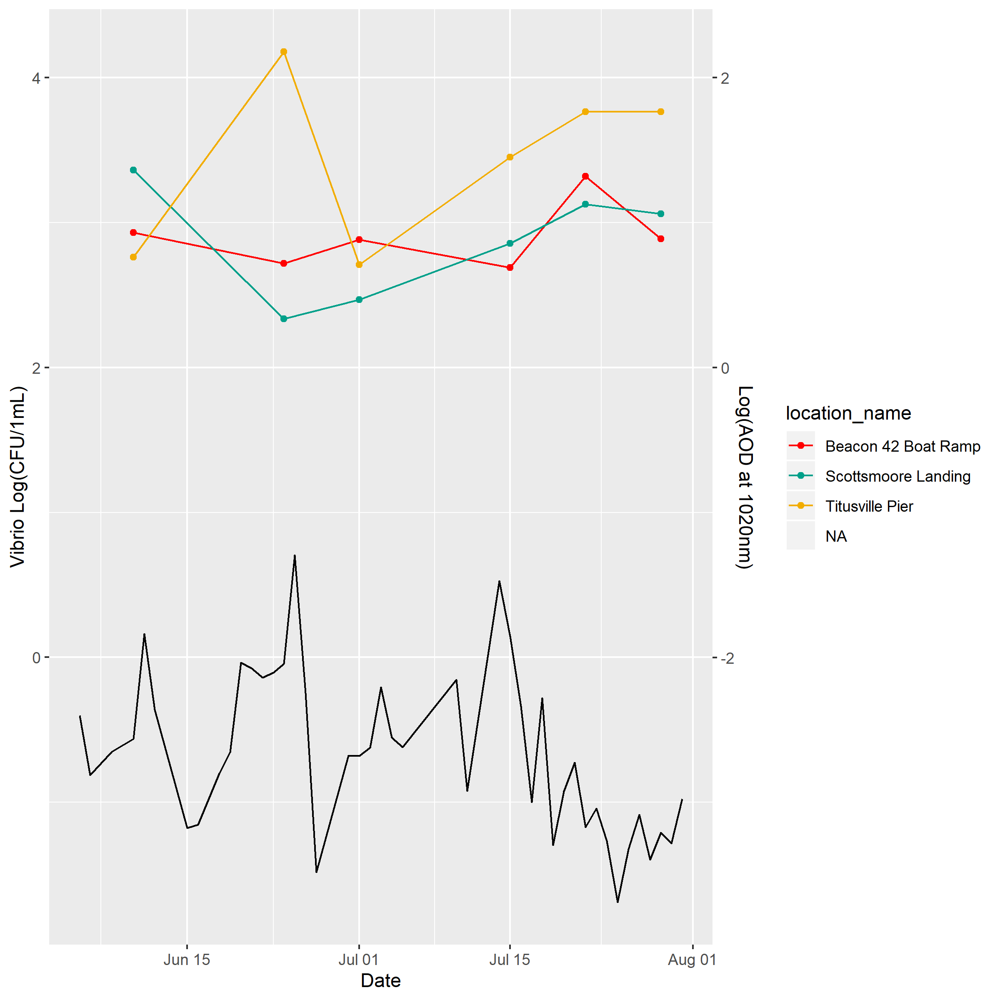
```

### St. Lucie Estuary

In the SLE, __Vibrio__ abundance bloomed between June 19 and July 3, 2019 at SLE 1, SLE 2, and SLE 3. __Vibrio__ abundance peaked at all three locations on June 26, 2019 (3.9 x 10^3 CFU/1mL,  2.3 x 10^3 CFU/1mL,5.8 x 10^3 CFU/1mL, respectively).

```{r fig.cap= "Enumeration of _Vibrio_ spp. and water quality parameters over time in the IRL. Salinity, pH, and water temperature were determined in field using refractometer and YSI sonde. Aerosol optical density (AOD at 1020nm) over time in the Indian River Lagoon and St. Lucie Estuary, as determined by Aeronet Station at Lake Okechobee.", echo=FALSE, warning=FALSE}
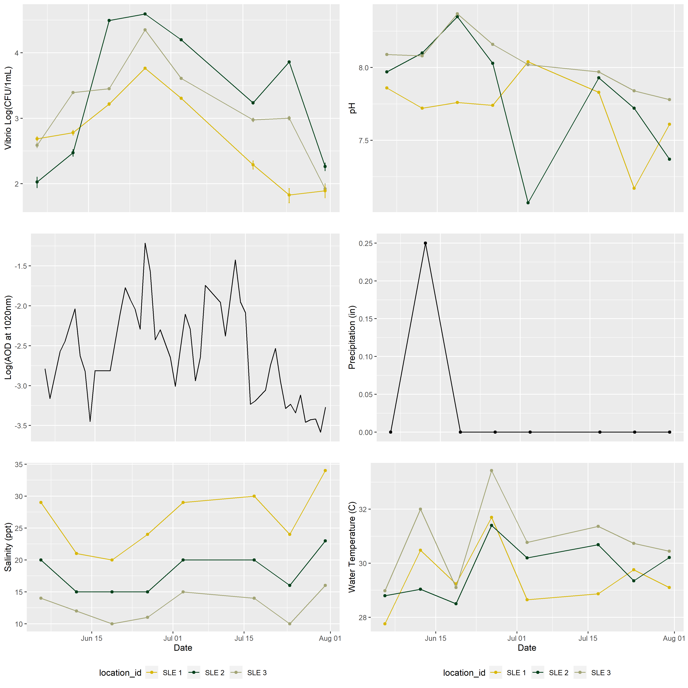
```

The peak in __Vibrio__ abundance appears again to correspond with increases in AOD at 1020nm. In the SLE, the AOD peaked on June 25, 2019 and again on July 13, 2019. As previously noted, the peak of _Vibrio_ abundance in the SLE was recorded on June 26, 2019, 24h following the peak AOD. 


```{r fig.cap= "Abundance of Vibrio spp. and aeorosol optical density in the SLE", echo=FALSE, warning=FALSE}
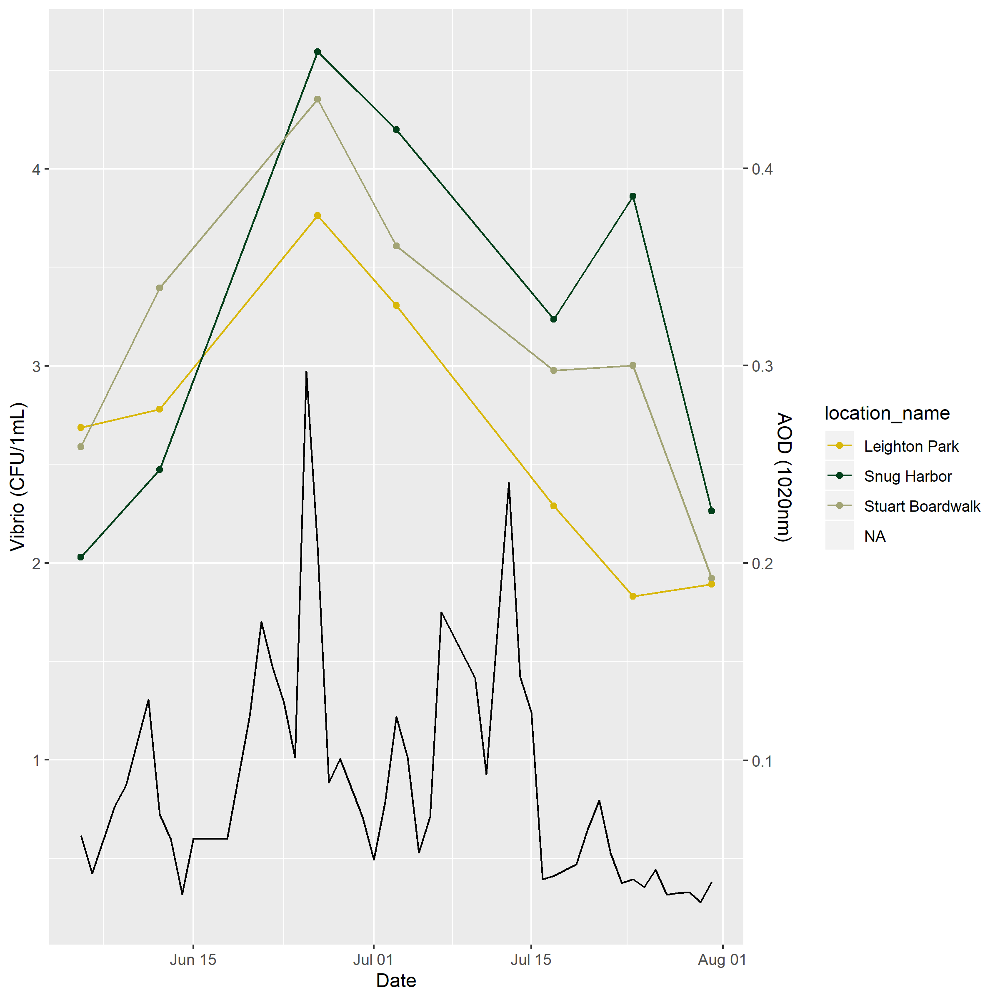
```

## Bivariate Analysis

In this analysis, we are interested in understanding how environmental variables influence _Vibrio_ abundance (our outcome of interest). Enumeration of bacteria from environmental samples do not typically conform to a normal distribution, but conform instead to a Poisson distribution [REF]. Results from the Shapiro-Wilk test for normality suggest that the _Vibrio_ counts from the IRL and SLE do not follow a normal distribution (p = 3.166 x 10 ^-11). When log-transformed, the _Vibrio_ counts can be assumed to follow a normal distribution (p = 0.3158).  

The correlation plots in (\ref{fig:fig7}) and (\ref{fig:fig8}) demonstrate the correlations between _Vibrio_ abundance and environmental variables and factors in methodology that may influence _Vibrio_ enumeration.


```{r fig.cap = "Enumeration of _Vibrio_ spp. from the Indian River Lagoon and St. Lucy Estuary in relation to water quality parameters.  Water quality parameters were determined in field using refractometer and YSI sonde.", echo = FALSE, warning=FALSE}
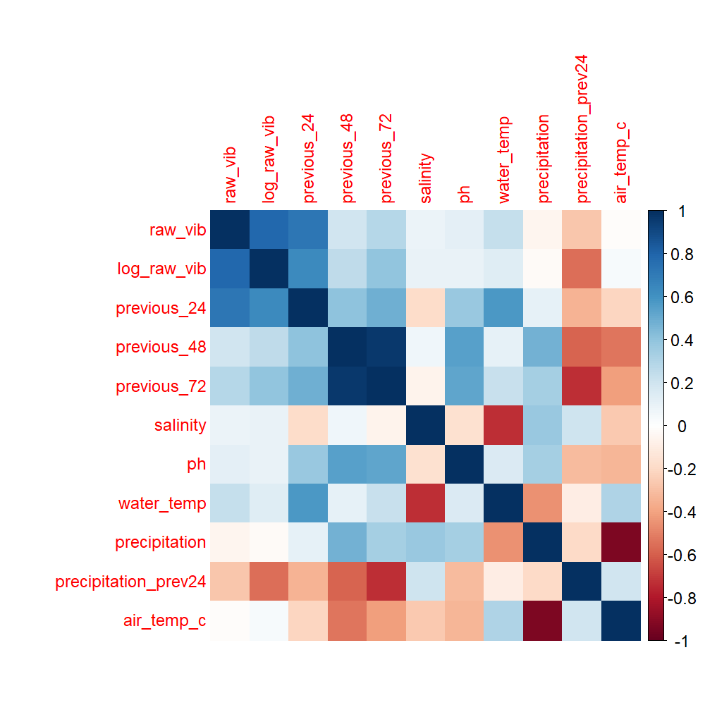
```


```{r fig.cap = "Enumeration of _Vibrio_ spp. from the Indian River Lagoon and St. Lucy Estuary in relation to water quality parameters.  Water quality parameters were determined in field using refractometer and YSI sonde.", echo = FALSE, warning=FALSE}
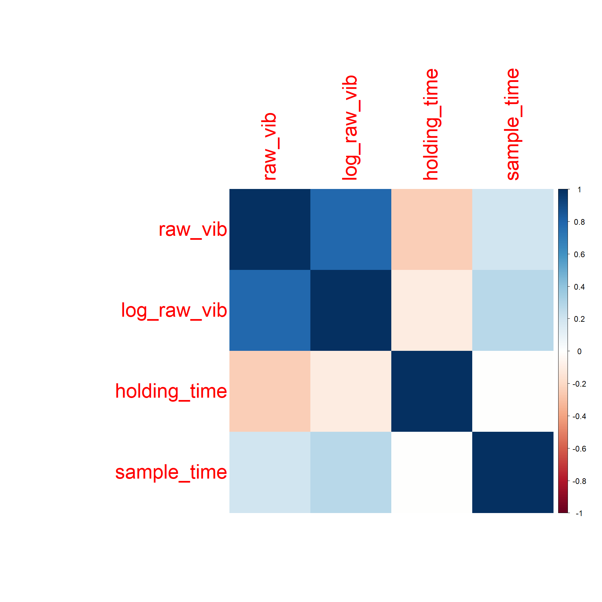
```

##Influence of Environmental Varibales on Vibrio Abundance in the Indian River Lagoon

```{r fig.cap = "Enumeration of _Vibrio_ spp. from the Indian River Lagoon in relation to environmental variables.Water quality parameters were determined in field using refractometer and YSI sonde.", echo = FALSE, warning=FALSE}
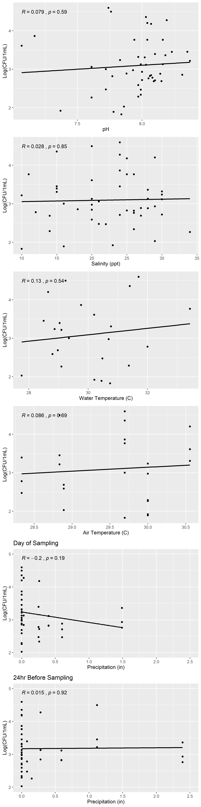
```

```{r fig.cap = "Enumeration of _Vibrio_ spp. from the Indian River Lagoon in relation to aerosol optical density.", echo = FALSE, warning=FALSE}
knitr::include_graphics("../../results/irl/irl_aod_vibrio.png")
```

##Influence of Environmental Varibales on Vibrio Abundance in the St. Lucie Estuary 

```{r fig.cap = "Enumeration of _Vibrio_ spp. from the St. Lucie Estuary in relation to environmental variables.Water quality parameters were determined in field using refractometer and YSI sonde.", echo = FALSE, warning=FALSE}
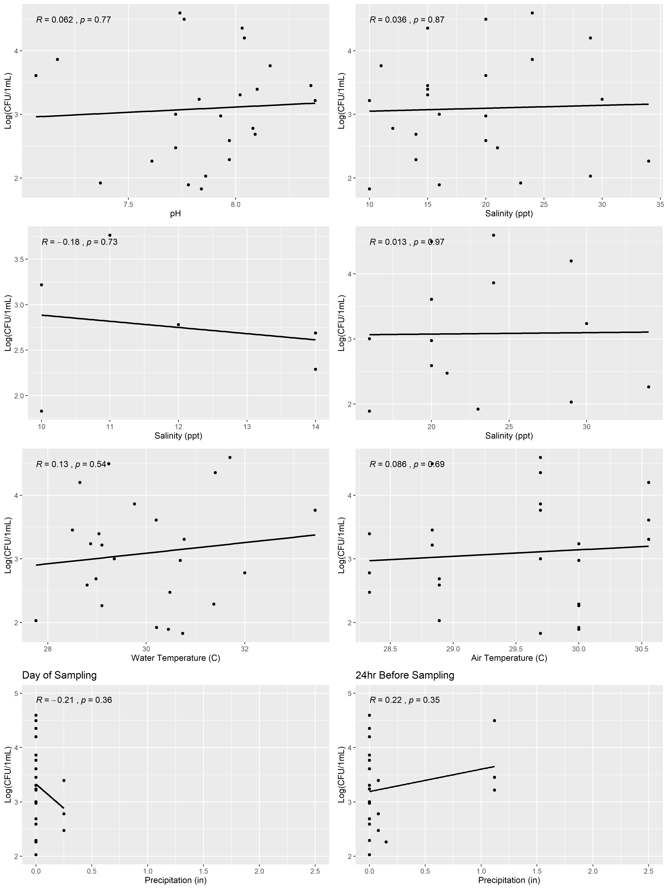
```


```{r fig.cap = "Enumeration of _Vibrio_ spp. from the Indian River Lagoon in relation to aerosol optical density.", echo = FALSE, warning=FALSE}
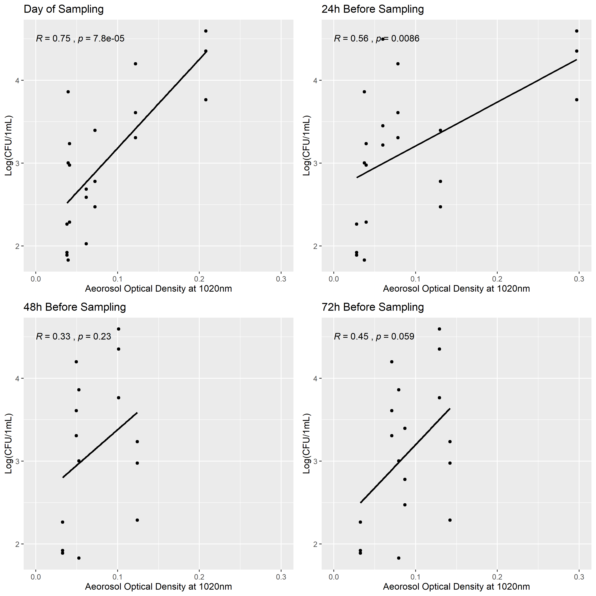
```

##Influence of Environmental Varibales on Vibrio Abundance, with Combined Analysis from the Indian River Lagoon and St. Lucie Estuary

```{r fig.cap = "Enumeration of _Vibrio_ spp. from the Indian River Lagoon and St. Lucy Estuary in relation to water quality parameters.  Water quality parameters were determined in field using refractometer and YSI sonde.", echo = FALSE, warning=FALSE}
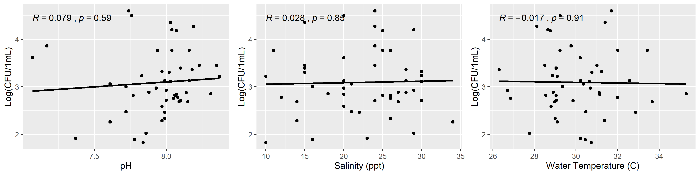
```

```{r fig.cap = "Enumeration of _Vibrio_ spp. from the Indian River Lagoon and St. Lucy Estuary in relation to Precipitation the day of sampling and 24h before sampling.", echo = FALSE, warning=FALSE}
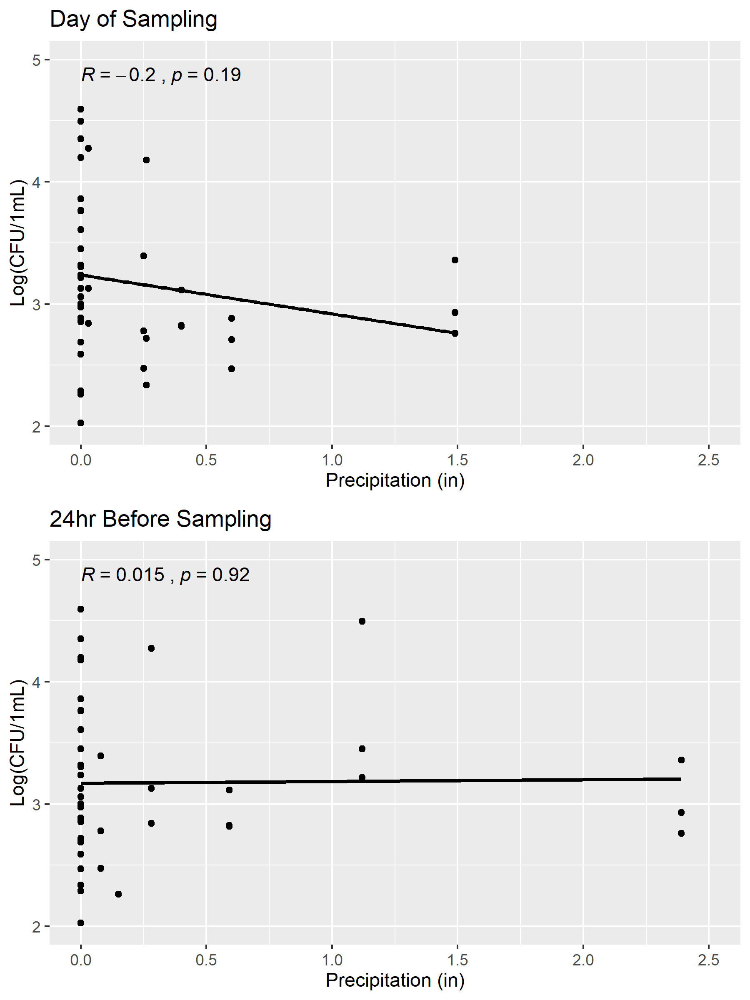
```

```{r fig.cap = "Enumeration of _Vibrio_ spp. from the Indian River Lagoon and St. Lucy Estuary in relation to Aerosol Optical Density (1020nm).", echo = FALSE, warning=FALSE}
knitr::include_graphics("../../results/all/aod.png")
```


## Full analysis

# Discussion

## Summary and Interpretation
_Summarize what you did, what you found and what it means._

## Strengths and Limitations
_Discuss what you perceive as strengths and limitations of your analysis._

## Conclusions
_What are the main take-home messages?_


_Include citations in your Rmd file using bibtex, the list of references will automatically be placed at the end_

# References

