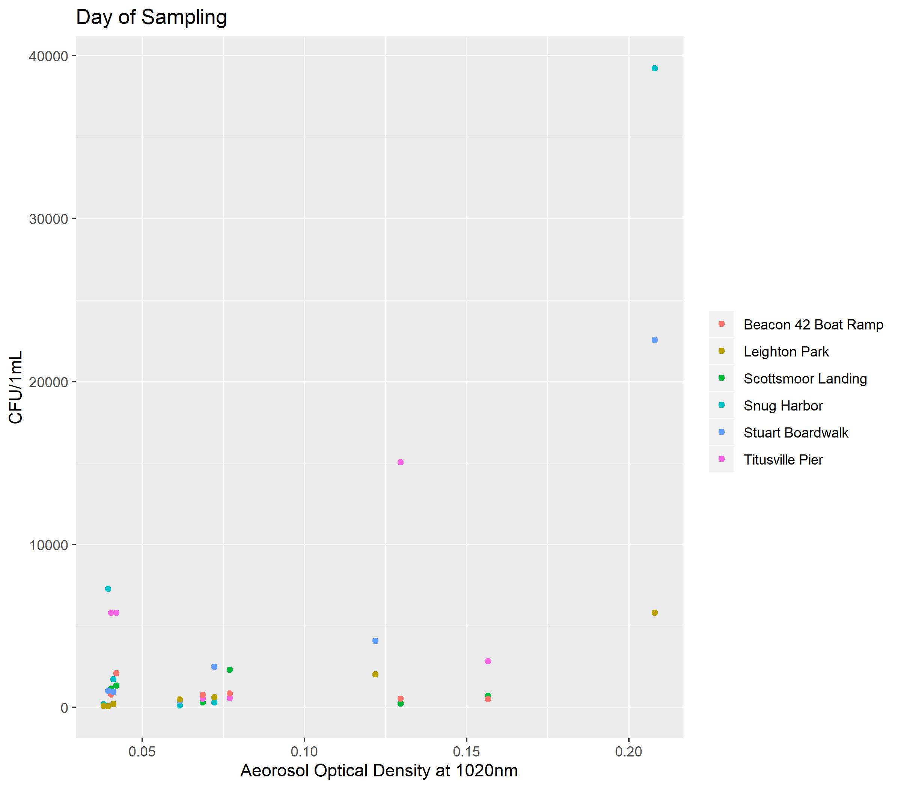
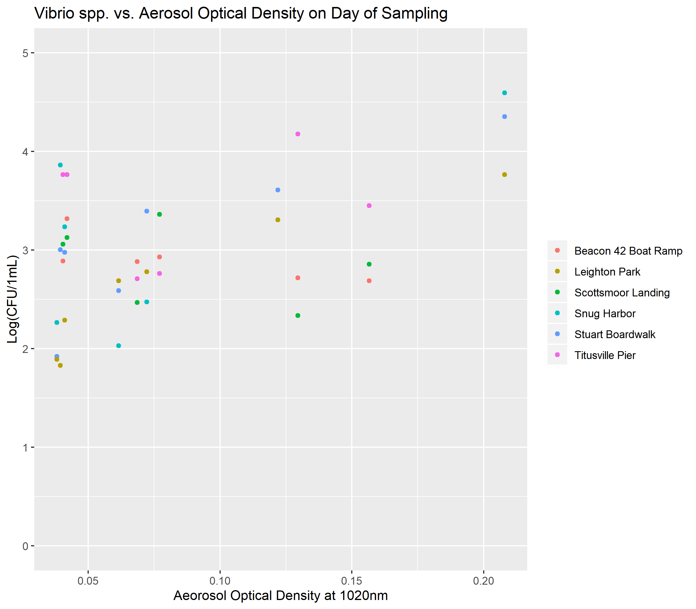
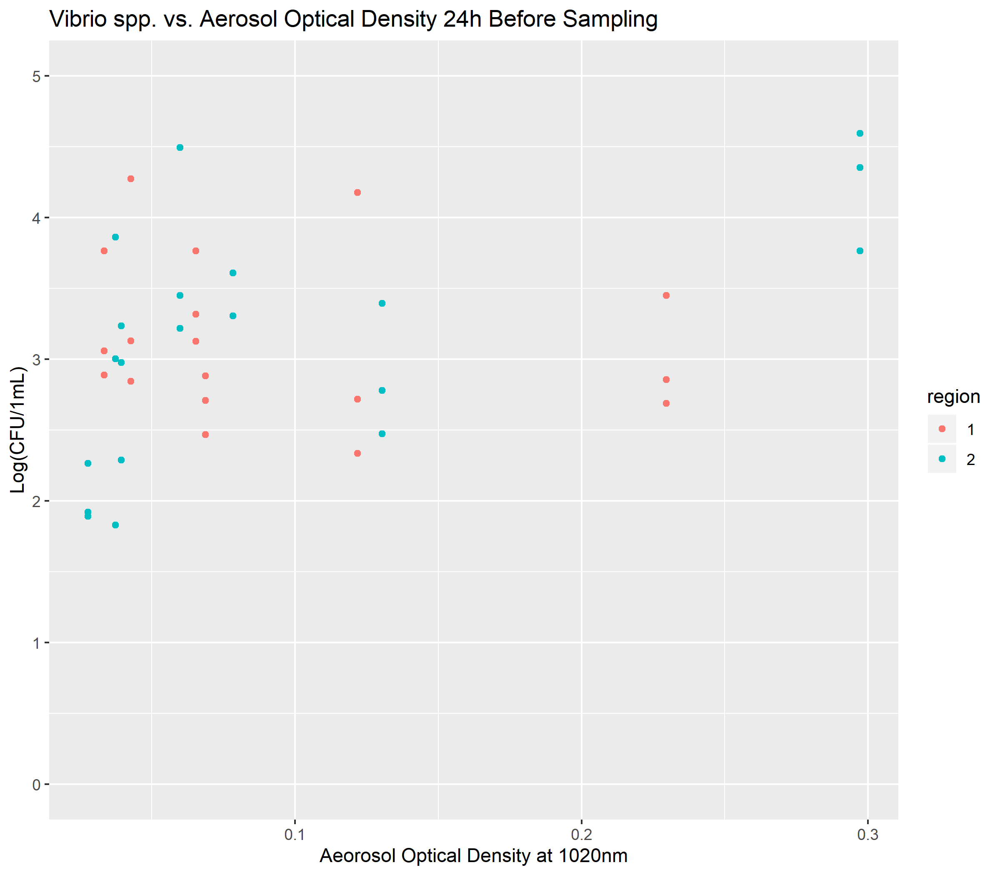
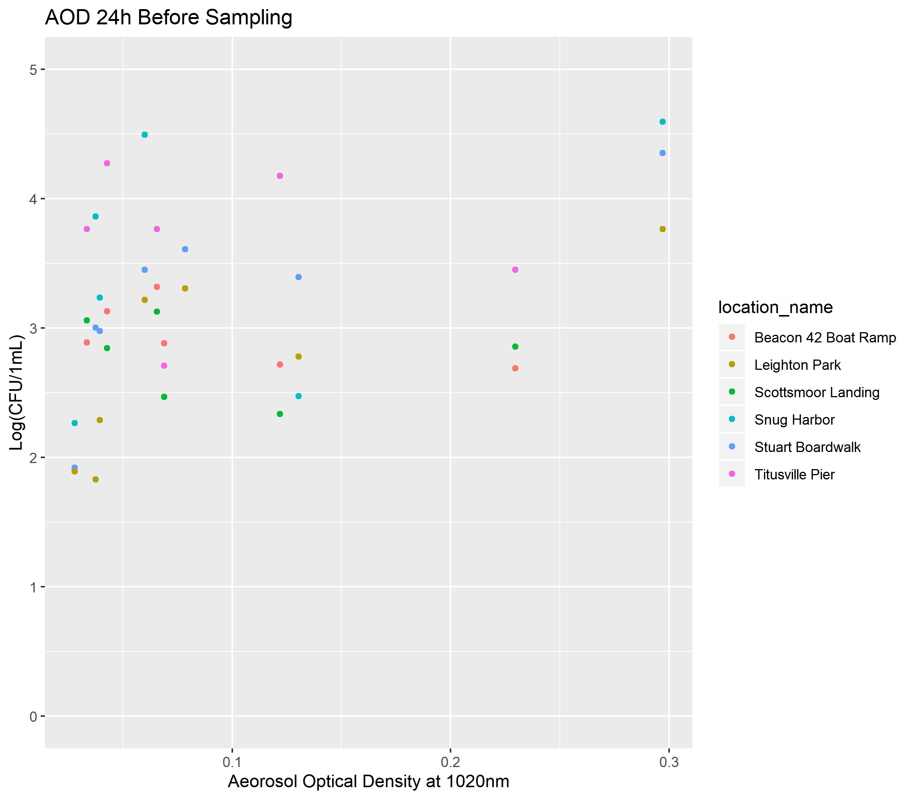
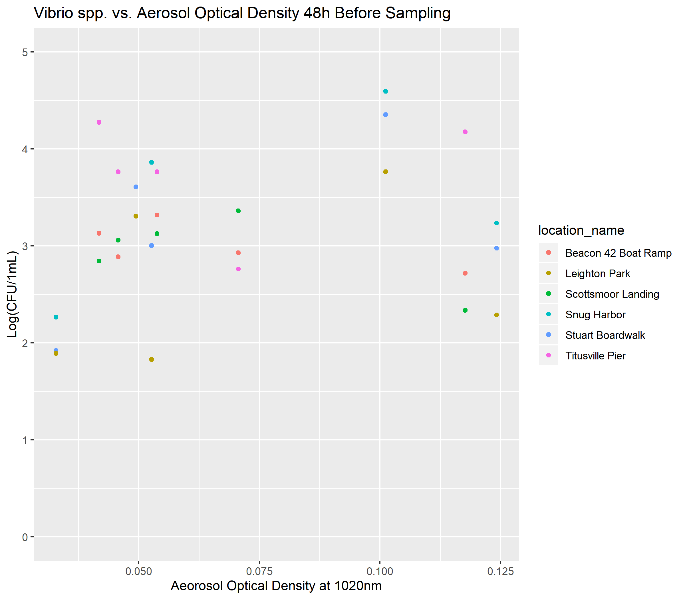
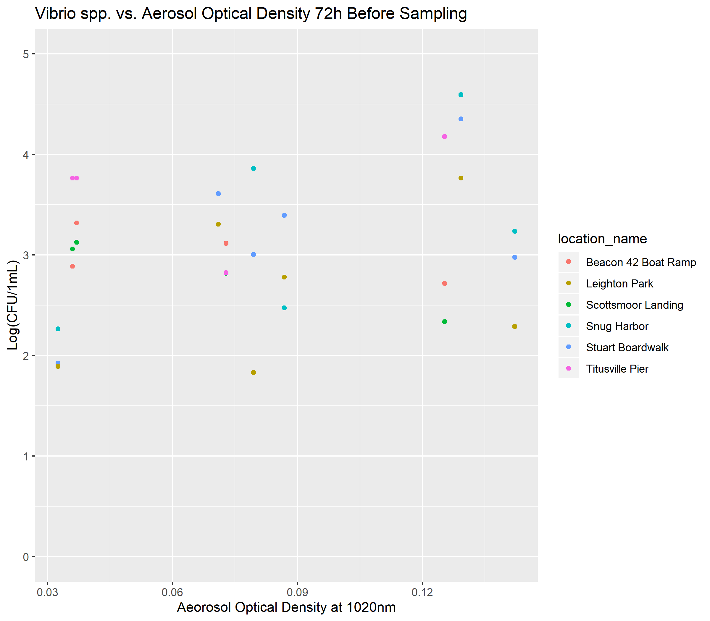

# Summary/Abstract
_Write a summary of your project._


# Introduction (required for part 1)

## General Background Information

Bacteria are increasingly recognized for their role in modulating harmful algal blooms (HABs) [REF]. In turn, algal blooms have been found to stimulate microbial activity of the aquatic bacterial community, including pathogenic bacteria [REF]. 

Vibrio spp. are a group of human pathogenic bacteria that are ubiquitous in estuary and marine environments. Vibrio illnesses are typically associated with the consumption of contaminated water and seafood, or with the infection of exposed wounds. V. vulnificus infection is the leading cause of seafood-borne deaths in the United States, usually the infection of exposed wounds by contaminated waters. 

Research has demonstrated that the distribution and dynamics of Vibrio populations are heavily influenced by environmental factors and that Vibrio abundance increases during algal blooms [REF]. Rapid algal growth may provide substrates and surfaces that stimulate Vibrio growth. Phytoplankton blooms may influence Vibrio ecology. In turn, Vibrio blooms may pose health risks to local populations.

Investigating bacterial-algal interactions improves our understanding how HAB events shape microbial health risks. 

Our research is conducted along Florida’s Indian River Lagoon (IRL), which stretches along Florida’s east coast. The IRL is an estuary of national significance and is protected by the USA National Estuaries Program. In recent years, the IRL has suffered from dense and damaging algal blooms, including those caused by the novel brown tide algae Aureoumbra lagunensis and by the toxic blue-green algae Microcystis aeruginosa. Our research aims to investigate the interactions between bacteria and harmful algae during these HAB events. 

We aimed to observe these dynamics during the summer of 2019. During this period, **we did not observe an algal bloom** at our field site. **but** we did collect a wealth of data on Vibrio populations and environemntal variables. I am hoping to use this project as an opportunity to examine our data with these variables. With a reproducible analysis, I am hopeful that we can collect and analyze our data when a bloom event arises.    

## Description of data and data source

The primary data shared here was collected during our 2019 field season. During this field season, surface water samples were collected from the Northern Indian River Lagoon and the St. Lucie Estuary, along Florida's eastern coast. Weekly samples were collected between June 5, 2019 and July 30, 2019. Environemntal variables were measured at the time of sampling. Samples were processed to enumerate Vibrio bacteria from water samples. 

We will also include here environmental variables measured or predicted by other agencies. This data includes information on aerosol deposition (dust data), precipitation, and surface water flow. 

## Questions/Hypotheses to be addressed

Broadly, we aim to examine the associations between Vibrio spp. and harfmul algal species during the succession of a bloom event. We ask: do harmful algal blooms promote Vibrio growth during a bloom event? We hypothesize that Vibrio populations will increase during brown tide blooms. The ecology of these two organisms are similar (they both thrive in warm, salty waters). In contrast, we predict that Vibrio populations will decrease during the toxic blue-green algae blooms caused by Microcystis aeruginosa. Microcystis thrives in freshwaters and produces a harmful toxin that may damage Vibrio bacteria. 

We're still keeping a watchful eye for an alagl bloom back in Florida, but until then, we hope to ask more exploratory questions to see if there are trends or relationships between Vibrio bacteria and other environmental variables. 

In this analysis, we ask: how do environemntal conditions influence Vibrio populations in Florida's Indian River Lagoon? Can the patterns in our Vibrio data be explained by salinity, pH, water temperature, precipitation, or aerosol deposition? We predict that Vibrio populations increase with warmer temperatures and with salinity. 

During this field season, there was a notable "dust event," where Saharan Dust was transported across the Atlantic to Florida's coast. This dust may provide nutrients for rapid Vibrio growth. Are there associations between the dust patterns and Vibrio populations? 

# Methods and Results

_In most research papers, results and methods are separate. You can combine them here if you find it easier. You are also welcome to structure things such that those are separate sections._


## Data aquisition
Vibrio Data - Culturable Vibrio were enumerated from surface waters by spread plate onto TCBS.  

Environmental Data - Water temperature and pH were determined using a YSI sonde.Salinity was determined using a refractometer. Data was collected on site at the time of sampling.  

Dust Data - Daily averages for aerosol optical depth (AOD) were obtained from [AERONET Version 3](https://aeronet.gsfc.nasa.gov/new_web/data.html). The AOD values were obtained for stations at NASA Kennedy Space Center and Lake Okeechobee to approximate the aerosol optical depth in the Northern Indian River Lagoon (IRL), and the St. Lucie Estuary (SLE), respectively. The following data are cloud cleared and quality controls have been applied but these data may not have final calibration applied. For more information on this data, contact: PI Nima_Pahlevan at nima.pahlevan@nasa.gov

## Data import and cleaning
_Write code that reads in the file and cleans it so it's ready for analysis. Since this will be fairly long code for most datasets, it might be a good idea to have it in one or several R scripts. If that is the case, explain here briefly what each file does. The files themselves should be commented well so everyone can follow along._

```{r resultfigure,  fig.cap='Analysis figure.', echo=FALSE}

knitr::include_graphics("../../results/irl_vibrio.png")
knitr::include_graphics("../../results/sle_vibrio.png")







```


## Univariate analysis
_Use a combination of text/tables/figures to explore and describe your data. You should produce plots or tables or other summary quantities for most of your variables. You definitely need to do it for the important variables, i.e. if you have main exposure or outcome variables, those need to be explored. Depending on the total number of variables in your dataset, explore all or some of the others._

## Bivariate analysis
_Create plots or tables and compute simple statistics (e.g. t-tests, simple regression model with 1 predictor, etc.) to look for associations between your outcome(s) and each individual predictor variable_


## Full analysis
_Use one or several suitable statistical/machine learning methods to analyze your data and to produce meaningful figures, tables, etc. This might again be code that is best placed in one or several separate R scripts that need to be well documented. You can then load the results produced by this code_

# Discussion

## Summary and Interpretation
_Summarize what you did, what you found and what it means._

## Strengths and Limitations
_Discuss what you perceive as strengths and limitations of your analysis._

## Conclusions
_What are the main take-home messages?_


_Include citations in your Rmd file using bibtex, the list of references will automatically be placed at the end_

# References

