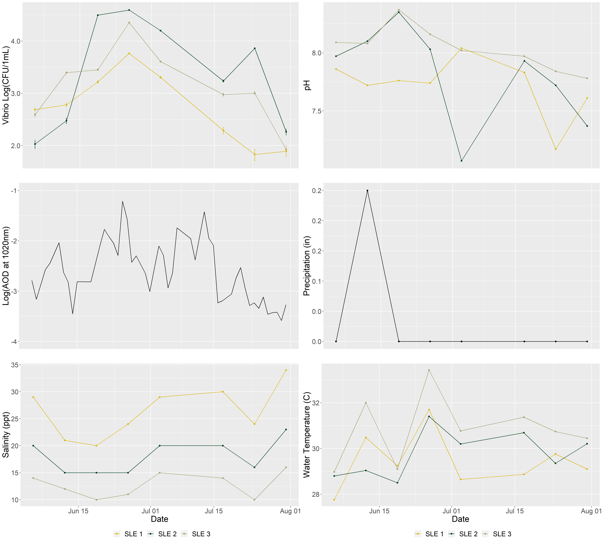
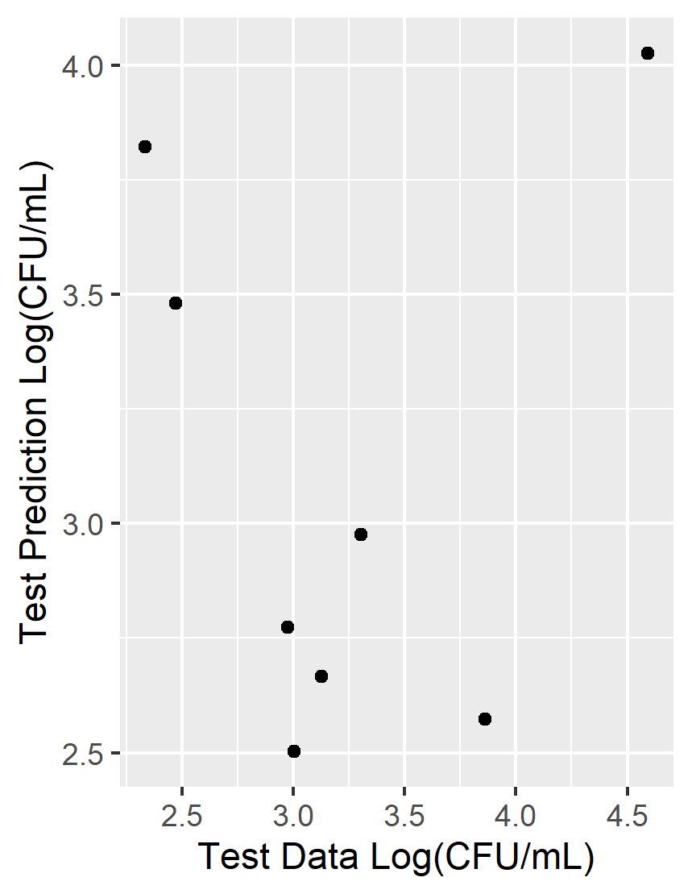

# Summary/Abstract
Harmful Algal Blooms (HABs) are an emerging concern for ecosystem and human health. Little is known about the influence of these HAB events on _Vibrio_ dynamics in Florida’s estuaries. The “Omics” revolution has improved the resolution and scale by which researchers investigate the complex interactions between _Vibrio_ bacteria and algae in natural waters. Through a genomics approach, this study examines the dynamics between _Vibrio_ populations and harmful algal blooms in Florida’s Indian River Lagoon system. Surface water samples were collected from the Northern Indian River and St. Lucie Estuary weekly between June and July 2019. Samples were size fractionated to separate particle-attached and planktonic _Vibrio_ bacteria. From each fraction, _Vibrio_ abundance was estimated by culture-based methods as well as quantitate PCR (qPCR), targeting the RNA polymerase subunit A (rpoA). The abundance of phytoplankton was determined by flow cytometry. To characterize the species-specific associations between _Vibrio_ and phytoplankton, the _Vibrio_ hsp60 gene was amplified and sequenced from each fraction. This research demonstrates the correlations between _Vibrio_ and phytoplankton abundance, while providing improved resolution of _Vibrio_ assemblages associated with microalgae. By investigating bacterial-algal interactions, we may improve our understanding of how HAB events shape _Vibrio_ ecology and microbial health risks.


# Introduction 

## General Background Information

Harmful algal blooms (HABs) are an emerging global concern for ecosystem and public health. HAB events adversely affect water quality and deteriorate aquatic habitats. Contaminated waters pose public health risks, as HAB events may produce harmful toxins or promote the growth of pathogenic bacteria [@Greenfield2017;@Kazamia2016].

Bacteria are increasingly recognized for their role in modulating HAB bloom dynamics [@Jones2010a;@Fandino2001;@Zhou2018;@Seong2013; @Ramanan2016;@Cooper2015]. Similarly, algal blooms have been found to affect the activity of aquatic bacteria. 

_Vibrio_ spp. are a group of human pathogenic bacteria that are ubiquitous in estuary and marine environments. _Vibrio_ illnesses are typically associated with the consumption of contaminated water and seafood, or with the infection of exposed wounds. _V. vulnificus_ infection is the leading cause of seafood-borne deaths in the United States, usually the infection of exposed wounds by contaminated waters. Research has demonstrated that the distribution and dynamics of _Vibrio_ populations are influenced by algal dyanamics [@Greenfield2017; @Main2015].Rapid algal growth may provide substrates and surfaces that stimulate _Vibrio_ growth [@Main2015]. 

Phytoplankton blooms may influence _Vibrio_ ecology. In turn, _Vibrio_ blooms may pose health risks to local populations.Investigating bacterial-algal interactions improves our understanding how HAB events shape microbial health risks. 

Our research investigates _Vibrio_ dynamics along Florida’s Indian River Lagoon (IRL), on Florida’s east coast. The IRL is an estuary of national significance and is protected by the USA National Estuaries Program. In recent years, the IRL has suffered from dense and damaging algal blooms, including those caused by the novel brown tide algae _Aureoumbra lagunensis_ and by the toxic blue-green algae _Microcystis aeruginosa_ [@Phlips2002; @Kang2015; @Oehrle2017]. Our research aims to investigate the interactions between bacteria and harmful algae during these HAB events. 

We aimed to observe these dynamics during the summer of 2019. During this period, **we did not observe an algal bloom** at our field site. **but** we did collect a wealth of data on _Vibrio_ populations and environemntal variables. I am hoping to use this project as an opportunity to examine our data with these variables. With a reproducible analysis, I am hopeful that we can collect and analyze our data when a bloom event arises.    

## Description of data and data source

The primary data shared here was collected during our 2019 field season. During this field season, surface water samples were collected from the Northern Indian River Lagoon and the St. Lucie Estuary, along Florida's eastern coast. Weekly samples were collected between June 5, 2019 and July 30, 2019. Environemntal variables were measured at the time of sampling. Samples were processed to enumerate _Vibrio_ bacteria from water samples. 

We will also include here environmental variables measured or predicted by other agencies. This data includes information on aerosol deposition (dust data), precipitation, and surface water flow. 

## Questions/Hypotheses to be addressed

Broadly, we aim to examine the associations between _Vibrio_ spp. and harfmul algal species during the succession of a bloom event. We ask: do harmful algal blooms promote _Vibrio_ growth during a bloom event? We hypothesize that _Vibrio_ populations will increase during brown tide blooms. The ecology of these two organisms are similar (they both thrive in warm, salty waters). In contrast, we predict that _Vibrio_ populations will decrease during the toxic blue-green algae blooms caused by Microcystis aeruginosa. Microcystis thrives in freshwaters and produces a harmful toxin that may damage _Vibrio_ bacteria. 

We're still keeping a watchful eye for an alagl bloom back in Florida, but until then, we hope to ask more exploratory questions to see if there are trends or relationships between _Vibrio_ bacteria and other environmental variables. 

In this analysis, we ask: how do environemntal conditions influence _Vibrio_ populations in Florida's Indian River Lagoon? Can the patterns in our _Vibrio_ data be explained by salinity, pH, water temperature, precipitation, or aerosol deposition? We predict that _Vibrio_ populations increase with warmer temperatures and with salinity. 

During this field season, there was a notable "dust event," where Saharan Dust was transported across the Atlantic to Florida's coast. This dust may provide nutrients for rapid _Vibrio_ growth. Are there associations between the dust patterns and _Vibrio_ populations? 

# Methods

Water samples were collected in triplicate from three locations in both the Northern Indian River Lagoon and the St. Lucie Estuary. Samples were collected weekly between June 2019 and July 2019 to monitor phytoplankton and _Vibrio_ abundance (n = 144). 

In the Northern Indian River Lagoon (IRL), samples were collected from three locations: Scottsmoor Landing (IRL 1), Titusville Pier (IRL 2), and the Beacon 42 Boatramp (IRL 3). Samples were collected on the following dates: 6/10, 6/17, 6/24, 7/1, 7/8, 7/15, 7/22, 7/29. The NIRL is not heavily influenced by tidal mixing. 

In the St. Lucie Estuary (SLE), samples were collected from three locations: Snug Harbor Yacht Club (SLE 1), Stuart Boardwalk (SLE 2), and Leighton Park (SLE 3). Samples were collected on the following dates: 6/5, 6/12, 6/19, 6/26, 7/3,  7/17, 7/24, 7/31. The SLE is tidally influenced. Samples were collected during the outgoing tide. 

Water samples were pre-filtered using a sterilized 200-µm filter to remove debris, detritus, and zooplankton. Physical parameters of the sampling sites were measured in-field using a YSI sonde. Salinity was determined using a refractometer. Data was collected on site at the time of sampling. Water samples will be analyzed for Chl a and nutrient composition. Water quality will be cross-referenced with the Continuous Sensor-based Water Quality Data from St. John’s Water Management District. 

Samples were plated onto TCBS to culture and enumerate _Vibrio_ bacteria. Cell density of phytoplankton will be determined from fixed samples using direct counts and flow cytometry.

Water samples were size fractionated in series onto polycarbonate filters (2.0 µm) and Sterivex filters (0.22 µm) to seperate the particle-attached and planktonic bacterial communities. DNA will be extracted from stored filters using the Qiagen PowerSoil Pro Kit and phenol:chloroform:isoamyl extractions. Bacterial and phytoplankton DNA will be sequenced to characterize the aquatic microbial community.

Bacterial and cyanobacterial 16S rRNA will be amplified using universal 16S primers 515F/806R. Novel NGS sequencing of the _Vibrio_ heat shock  protein 60 (hsp60) will be sequenced to provide additional taxonomic resolution of the _Vibrio_ community. 18S rRNA will be amplified using the universal 18S primers EukA/329R10 as described in to analyze the phytoplankton community. 


## Data Aquisition

Daily averages for aerosol optical depth (AOD) were obtained from [AERONET Version 3](https://aeronet.gsfc.nasa.gov/new_web/data.html). The AOD values were obtained for stations at NASA Kennedy Space Center and Lake Okeechobee to approximate the aerosol optical depth in the Northern Indian River Lagoon (IRL), and the St. Lucie Estuary (SLE), respectively. The following data are cloud cleared and quality controls have been applied but these data may not have final calibration applied. For more information on this data, contact: PI Nima_Pahlevan at nima.pahlevan@nasa.gov. 

Daily averages of precipitation were obtained from [U.S. Climate Data](https://www.usclimatedata.com/). Precipitation data was obtained for Titusville, FL (-80.8159, 28.6241) and Stuart, FL (-80.2397, 27.1897) to approximate precipitation in the Northern Indian River Lagoon (IRL), and the St. Lucie Estuary (SLE), respectively. 

## Data Import and Cleaning

Water quality paramters and _Vibrio_ counts were recorded as data was collected.Daily averages for aerosol optical depth (AOD) were obtained from [AERONET Version 3](https://aeronet.gsfc.nasa.gov/new_web/data.html) on 9/12/2019. Daily averages of precipitation were obtained from [U.S. Climate Data](https://www.usclimatedata.com/) on 11/13/2019. 

Over the course of this study, 144 water samples were collected from eastern Florida. Water samples were collected in triplicate from six sample locations (IRL 1, IRL 2, IRL 3, SLE 1, SLE 2, SLE 3), during eight weekly sampling events. 

The IRL and SLE Vibrio count data sets each include 72 observations of Vibrio colonies enumerated from TCBS plates during the length of this study. Triplicates were averaged, resulting in a total of 24 observations in each data set.

The IRL and SLE environmental data sets each include 24 observations detailing the sampling time, water temperature, salinity, air temperature, and precipitation for each sampling event, at each sampling location. 

The data imported from Aeronet includes 45 observations of the average AOD between 6/5/2019 and 7/31/2019. In this analysis, we use AOD measured at 1020nm to approximate aerosolized Saharan Dust. 

The processing script provides code that imports and cleans the data included in this analysis.

#Results

## Univariate Analysis

In this univariate analysis, we aim to explore _Vibrio_ concentrations and environmental varaibles in the IRL and SLE between June 5, 2019 and July 31, 2019. _Vibrio_ was enumerated from two estuaries on Florida's east coast, over a period of eight weeks (\ref{fig:fig1}). 

```{r fig.cap='Enumeration of _Vibrio_ spp. from the Indian River Lagoon and St. Lucie Estuary. Samples were collected between June 5, 2019 and July 30, 2019. _Vibrio_ was enumerated on TCBS plates.', echo=FALSE, warning=FALSE}
knitr::include_graphics("../../results/all/all_Vibrio2.png")
```

## Indian River Lagoon 

In the IRL, _Vibrio_ abundance bloomed between June 17 and June 24, 2019 at the IRL 3 sampling location. During this bloom, the maximum _Vibrio_ abundance was recorded from the IRL, at 1.9 x 10^4 CFU/1mL. No bloom was obsered at the IRL 1 or IRL 2 locations during this time. In fact, the lowest _Vibrio_ abundance in the IRL was recorded at the IRL 2 location during this period, at 2.17 x 10^2 CFU/1mL on June 24, 2019. _Vibrio_ abundance increased again, at all three locations, on July 22, 2019. Enumeration of bacteria from environmental samples do not typically conform to a normal distribution, but conform instead to a Poisson distribution. Results from the Shapiro-Wilk test for normality suggest that the _Vibrio_ counts from the IRL do not follow a normal distribution (p = 1.52 x 10^-7. Typically, counts will follow a normal distribution following log transformation. However, the Vibrio counts from the IRL do not follow a normal distribution when log-trnasformed (p = 3.04 x 10^-2).  

In the IRL, the average AOD during this study period was 0.083. The AOD ranged between 0.025 and 0.274 over this period, peaking on June 25, 2019 (0.274) and again on July 14, 2019 (0.230). Results from the Shapiro-Wilk test for normality suggest that the AOD in the IRL does not follow a normal distribution (p = 8.09 x 10^-15). When log-transformed, the AOD can be assumed to follow a normal distribution (p =  5.52 x 10^-1).  

Salinity in the IRL ranged between 18 ppt and 30 ppt during this study period. Results from the Shapiro-Wilk test for normality suggest that salinity in the IRL does follow a normal distribution (p = 2.21 x 10^-1). The salinity was distinctly different between the three IRL sampling locations (One-way ANOVA, p = 1.12 x 10^-4). At IRL 1, the average salnity was 23 ppt and ranged from 18 ppt to 28 ppt. At IRL 2, the average salinity was 25 ppt and ranged from 24 ppt to 26 ppt. At IRL 3, the average salinity was 29 ppt and ranged from 27 ppt to 30 ppt. 

The average pH in the IRL was 8.03 and ranged between 7.61 and 8.31 during this study period. The pH is normally distributed in he IRL (Shapiro-Wilk, p = 1.37 x 10^-1), and the pH is not distinctly different between the three locations (One-way ANOVA, p = 4.46 x 10^-1). The pH appeared to peak at all three sampling locations on July 15, 2019. The pH declined at location IRL 1 to 7.61 on July 29, 2019. This was the lowest pH observed in the IRL over the course of this study and correspondeds with a drop in salinity at the same location. 

The daily average precipitation in Titusville, FL ranged from 0.00 in. to 1.49 in. The average air temperature was 27.3 C and ranged from 26.4 C to 28.0 C. Precipitation and air temperature in Titusville, FL was used to approximate the precipition in the IRL during this study period.

The average water temperature in the IRL was 30.10 and ranged from 26.3 C to 35.3 C. The water temperature is normally distributed (Shapiro-Wilk, 8.09 x 10^-1) and does not differ significantly between sampling locations (One-way ANOVA, 4.00 x 10^-1). The water temperature peaked at all three locations on July 15, 2019.

```{r fig.cap = "Enumeration of _Vibrio_ spp. and environmental variables over time in the IRL. Water quality parameters salinity, pH, and water temperature were determined in field using refractometer and YSI sonde. Aerosol optical density (AOD at 1020nm) was determined by Aeronet Station at KSC.", echo=FALSE, warning=FALSE}
knitr::include_graphics("../../results/irl/irl_env_date.png")
```

Water quality parameters appeared to follow a distinct pattern of fluxuating conditions, as though they were tidally influenced; however, this estuary is not influenced by tidal mixing. Examining the time of sampling in the IRL, it appears that time of sample collection fluxuates in the same or similar pattern. Samples were collected from each location in the following order: IRL 1, IRL 2, IRL 3. The average sampling time at the first location (IRL 1) was approximately 1100, but ranged from 0551 and 1455.  Notably, sample collection finished latest on July 15, 2019. 


```{r fig.cap= "Time of sample collection from IRL 1, IRL 2, and IRL 3 between June 10 and July 29, 2019.", echo=FALSE, warning=FALSE}
knitr::include_graphics("../../results/irl/irl_sample_time.png")
```

The peak in _Vibrio_ abundance appears to correspond with increases in AOD at 1020nm. In the IRL, the AOD peaked on June 25, 2019 and again on July 14, 2019. Samples were collected from the IRL on June 24 and July 15, 2019.


```{r fig.cap= "Abundance of Vibrio spp. and Aeorosol Optical Density in the IRL", echo=FALSE, warning=FALSE}
knitr::include_graphics("../../results/irl/irl_dust_vibrio.png")
```

## St. Lucie Estuary

In the SLE, _Vibrio_ abundance bloomed between June 19 and July 3, 2019 at SLE 1, SLE 2, and SLE 3. _Vibrio_ abundance peaked at all three locations on June 26, 2019 (3.9 x 10^3 CFU/1mL,  2.3 x 10^3 CFU/1mL,5.8 x 10^3 CFU/1mL, respectively). Results from the Shapiro-Wilk test for normality suggest that the _Vibrio_ counts from the SLE do not follow a normal distribution (p = 7.10 x 10^-7, but do follow a normal distribution when log-trnasformed (p = 4.06 x 10^-1). The enumeration of total Vibrio does not differ between sampling locations in the SLE (One-way ANOVA, p = 2.81 x 10^-1).


The average AOD in the SLE during this study period was 8.8294 x 10^-2. The AOD ranged between 2.7799 x 10^-2 and 2.97130 x 10^-1 over this period. The AOD peaked on June 25, 2019 (2.97130 x 10^-1) and again on July 13, 2019 (2.4067 x 10^-1). Results from the Shapiro-Wilk test for normality suggest that the AOD in the SLE does not follow a normal distribution (p = 2.00 x 10^-5). When log-transformed, the AOD can be assumed to follow a normal distribution (p =  2.23 x 10^-1).  

Salinity in the SLE follows a normal distribution (Shapiro-Wilk, p = 1.19 X 10^-1), but average salinity is significantly different between the three sampling locations (One-way ANOVA, p = 8.53 x 10^-7). At SLE 1, the average salnity was 26 ppt and ranged from 20 ppt to 34 ppt. At SLE 2, the average salinity was 18 ppt and ranged from 15 ppt to 23 ppt. At SLE 3, the average salinity was 13 ppt and ranged from 10 ppt to 16 ppt. 

The average pH in the SLE was 7.86 and ranged between 7.07 and 8.37 during this study period. The pH is normally distributed in the SLE (Shapiro-Wilk, p = 0.91 x 10^-1), and the pH is not distinctly different between the three locations (One-way ANOVA, p = 1.15 x 10^-1). 

The average precipitation in Stuart, FL ranged from 0.00 in. to 0.25 in on the days of sample collection. The average air temperature was 29.5 C, and ranged from 28.3 and 30.6 C. Precipitation and air temperature in Stuart, FL was used to approximate the precipition in the SLE durin gthis study period.

The average water temperature in the SLE was 30.02 and ranged from 27.76 C to 33.43 C. The water temperature is normally distributed (Shapiro-Wilk, 3.54 x 10^-1) and does not differ significantly between sampling locations (One-way ANOVA, 8.19 x 10^-2). 

```{r fig.cap= "Enumeration of _Vibrio_ spp. and water quality parameters over time in the IRL. Salinity, pH, and water temperature were determined in field using refractometer and YSI sonde. Aerosol optical density (AOD at 1020nm) over time in the Indian River Lagoon and St. Lucie Estuary, as determined by Aeronet Station at Lake Okechobee.", echo=FALSE, warning=FALSE}

```

The peak in _Vibrio_ abundance appears again to correspond with increases in AOD at 1020nm. In the SLE, the AOD peaked on June 25, 2019 and again on July 13, 2019. As previously noted, the peak of _Vibrio_ abundance in the SLE was recorded on June 26, 2019, 24h following the peak AOD. 


```{r fig.cap= "Abundance of Vibrio spp. and aeorosol optical density in the SLE", echo=FALSE, warning=FALSE}
knitr::include_graphics("../../results/sle/sle_dust_vibrio.png")
```

## Bivariate Analysis

In this analysis, we are interested in understanding how environmental variables influence _Vibrio_ abundance (our outcome of interest). 

The correlation plots in (\ref{fig:fig7}) and (\ref{fig:fig8}) demonstrate the correlations between _Vibrio_ abundance and environmental variables and factors in methodology that may influence _Vibrio_ enumeration. These correlation plots provide a brief overview of the relationships that might be important in determining our recorded _Vibrio_ abundance. Specifically, these correlation plots suggest that we may want to keep a watchful eye on the relationships between _Vibrio_ abundance and the AOD 24 hours prior to sampling. Additionally, we will want to consider the relationships between _Vibrio_ abundance and precipitation 24 hours prior to sampling. We see some interesting corrlations between air temperature and precipitation and between water temperature and salinity. These relationshipships have natural relationships. The relationship between AOD and precipitation, however, is not as logical.  


```{r fig.cap = "Correlation between _Vibrio_ abundance and environmental variables.", echo = FALSE, warning=FALSE}
knitr::include_graphics("../../results/all/corr_plot_environmental.png")
```


```{r fig.cap = "Correlation between _Vibrio_ abundance and methodological variables, such as sampling time and sample holding time.", echo = FALSE, warning=FALSE}
knitr::include_graphics("../../results/all/corr_plot_methods.png")
```

##Influence of Environmental Varibales on _Vibrio_ Abundance in the Indian River Lagoon

We begin to examine the relationship between environmental varibales and _Vibrio_ abundance with simple linear regression. 

The plots in (\ref{fig:fig}) assess the linear relationship between log-transformed _Vibrio_ abundance in the IRL and pH, salinity, water temperature and air temperature measured on the day of sampling. Additionally, this plot evaluates the linear relationship betwen _Vibrio_ abundance and precipitation the day of and day before sampling. There does not appear to be a statistically significant relationship between any of these varaibles and _Vibrio_ abundance. 


```{r fig.cap = "Enumeration of _Vibrio_ spp. from the Indian River Lagoon in relation to environmental variables. Pearson's correlation coefficient (R) and p-value (p) presented for each relationship. ", echo = FALSE, warning=FALSE}
knitr::include_graphics("../../results/irl/irl_env_vibrio.png")
```
The plots in (\ref{fig:fig}) assess the linear relationship between log-transformed _Vibrio_ abundance and normalized AOD in the IRL. The correlation is examined for the AOD measured on the day of sampling, 24 hours before sampling, 48 hours before sampling, and 72 hours before sampling. There appears to be no statistically significant linear relationship between AOD and _Vibrio_ abundance in the IRL.

```{r fig.cap = "Enumeration of _Vibrio_ spp. from the Indian River Lagoon in relation to AOD on the day of sampling, 24 hours before sampling, 48 hours before sampling, and 72 hours before sampling. Pearson's correlation coefficient (R) and p-value (p) presented for each relationship.", echo = FALSE, warning=FALSE}
knitr::include_graphics("../../results/irl/irl_aod_vibrio.png")
```

##Influence of Environmental Varibales on Vibrio Abundance in the St. Lucie Estuary 

The plots in (\ref{fig:fig}) assess the linear relationship between normalized _Vibrio_ abundance in the SLE and pH, salinity, water temperature and air temperature measured on the day of sampling. Additional plots evaluate the linear relationship betwen _Vibrio_ abundance and salinity measured between 0 ppt to 15 ppt seperately from the salinity measured ay 15 ppt and 30 ppt. Precipitation the day of and day before sampling are examined in relation to _Vibrio_ abundance. There does not appear to be a statistically significant relationship between any of these varaibles and _Vibrio_ abundance. 

```{r fig.cap = "Enumeration of _Vibrio_ spp. from the St. Lucie Estuary in relation to environmental variables. Pearson's correlation coefficient (R) and p-value (p) presented for each relationship.", echo = FALSE, warning=FALSE}
knitr::include_graphics("../../results/sle/sle_env_vibrio.png")
```

The linear relationship between normalized _Vibrio_ abundance and normalized AOD in the SLE are examined in (\ref{fig:fig}). Unlike the IRL, there  does appears to be a statistically significant linear relationship between  _Vibrio_ abundance in the SLE and AOD measured the day of sampling ( p  1.1 x 10^-4), the day before sampling (p = 2.9 x 10^-3), and 72 hours before sampling (p = 2.6 x 10^-2).

```{r fig.cap = "Enumeration of _Vibrio_ spp. from the St. Lucie Estuary in relation to AOD. Pearson's correlation coefficient (R) and p-value (p) presented for each relationship.", echo = FALSE, warning=FALSE}
knitr::include_graphics("../../results/sle/sle_aod_vibrio.png")
```

##Influence of Environmental Varibales on Vibrio Abundance, with Combined Analysis from the Indian River Lagoon and St. Lucie Estuary

Although the IRL and SLE are seperated by 150 miles, it may be of interest to combine the two data sets to improve the number of observations included in the linear regression. 


There does not appear to be a linear relationship between _Vibrio_ abundance and environmental variables pH, salinity, water temperature, air temperature, or precipitation (\ref{fig:fig}). 

```{r fig.cap = "Enumeration of _Vibrio_ spp. from the Indian River Lagoon and St. Lucy Estuary in relation to water quality parameters.  Pearson's correlation coefficient (R) and p-value (p) presented for each relationship.", echo = FALSE, warning=FALSE}
knitr::include_graphics("../../results/all/env_var_vib.png")
```

There  does appears to be a statistically significant linear relationship between log-transformed  _Vibrio_ abundance in the IRL and SLE and normalized AOD measured the day of sampling (p = 3.8 x 10^-3).

```{r fig.cap = "Enumeration of _Vibrio_ spp. from the Indian River Lagoon and St. Lucy Estuary in relation to AOD at 1020nm.", echo = FALSE, warning=FALSE}
knitr::include_graphics("../../results/all/log_aod.png")
```

Using a simple linear regression model with the 'lm' linear model function  in R. In this model, the predictor variables are measured environmental varaibles, and the predicted variable is _Vibrio_ abundance in Log(CFU/1mL). In this analysis, AOD at 1020nm is normalized through log-transformation. The results from this model suggest that both the normalized values for AOD on the day of sampling and day before sampling are significantly correlated with _Vibrio_ abundance. There is no significant relationship with other environmental varaibles measured.

```{r echo = FALSE, warning=FALSE}
resulttable = readRDS("../../results/resulttable.rds")
knitr::kable(resulttable, caption = "Simple linear regression between _Vibrio_ abundance and environmental variables as measured from the Indian River Lagoon and St. Lucy Estuary.")
```


## Full Analysis

In this section of the analysis, we use statistical models to analyze the relationship between our environmental varaibles and _Vibrio_ abundance. We begin with a single predictor model with the outcome of _Vibrio_ abundance and the following predictors: normalized AOD day of sampling, normalized AOD the day before sampling, salinity, pH, water temperature, sampling time, and precipitation. When filtering for missing values, our data set contains 33 observations. These observations are then divided into a training set (25 observations) and a test set (8) observations.

Using the 'lm' linear model function, we can examine the RMSE of each single predictor. According to the RMSE values, the models that include the the normalized values of the AOD on the day of sampling and day before sampling may perform better than the other single-predictor models.

```{r echo = FALSE, warning=FALSE}
singlepredictor = readRDS("../../results/all/singlepredictor.rds")
knitr::kable(singlepredictor, caption = "RMSE of the simple linear regression between _Vibrio_ abundance and environmental variables as measured from the Indian River Lagoon and St. Lucy Estuary.")
```

When examining the full model in the training data set, with all 7 predictors, the RMSE was 0.8358849. The RMSE of the model with the test data set was 0.8522869. The full model did not perform as well as any of the single-predictor models. 

```{r fig.cap = "_Vibrio_ abundance predicted by the linear regression model with all predictors, in relation to _Vibrio_ abundance in the test data set.", echo = FALSE, warning=FALSE}

```

The next step in this analysis would be to complete a varaible or subset selection. 

Additionally, we explored a tree model to further explore the predictor variables and the _Vibrio_ abundance outcome. In this model, we included all 33 observations to improve the resolution of the tree model. The results from the tree model suggest once more, that the AOD is a significant predictor of _Vibrio_ abundance. 

```{r fig.cap = "_Vibrio_ abundance predicted by a tree model with all predictors.", echo = FALSE, warning=FALSE}

```

# Discussion

## Summary and Interpretation

In this analysis, we examine the relationship between environmental varaibles and _Vibrio_ abundance in Florida's eastern estuaries. We monitored _Vibrio_ abundance from three locations in the IRL and three locations in the SLE. We measured or collected data on water temperature, air temperature, pH, salinity, aerosol optical density, precipitation at each location or watershed. In our analysis, it appears that among these environmental variables, the aerosol optical density is significantly correlated with _Vibrio_ abundance. Results of the simple linear regression indicate the the normalized values of AOD on the day of sampling and day before sampling are significantly correlated with _Vibrio_ abundance. The linear model does not perform as well when all seven predictors are included in the model. 

## Strengths and Limitations

In this study, we aimed to examine the relationship between _Vibrio_ abundance and HAB events. We conducted itensive weekly sampling from two watersheds that suffer from reoccuring HAB events. Unfortunately, we did not observe an algal bloom during this sampling period. The results of this data analysis suggest, however, that there are still interesting relationships between environmental variables and _Vibrio_ abundance in the IRL and SLE.

This data anlysis focused on the linear relationship between _Vibrio_ abundance and several environmental varaibles. However, our study design includes time series data for our outcome and each predictor variable. Linear models may not be sufficient to explain the dynamic relationship between microbes and their physical environment. Future analyses should explore this data with time-series-specific modeling.

Our study design allowed for the collection and analysis of water samples across space and time. However, in this analysis, we have discovered that the watersheds and sampling locations may be distinctly different based on environmental and biological factors. Future analyses should explore this data using mixed-effects or multilevel modeling. 

This analysis considers the enviornmental varaibles that were measured in-situ or retrieved from publicly availible sources. We are still collecting data on other environmental and biological varaibles, including chlorophyll a concentration, nutrient levels, and phytoplankton abundance in these water samples. Our data collection and data analysis are still evolving.


## Conclusions
The transport and deposition of Saharan dust may influence _Vibrio_ populations in Eastern Florida. The dynamics in _Vibrio_ abundance in the IRL and SLE were explained by AOD moreso than salinity, pH, water temperature, air temperature, and precipitation. Peaks in AOD in late-June and mid-July correspond with peaks in _Vibrio_ abundance in the IRL and SLE. 

# References

