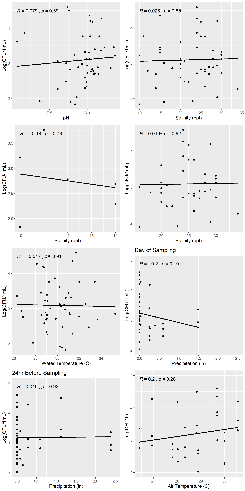

```{r setup, include=FALSE}
knitr::opts_chunk$set(echo = TRUE)
```


```{r fig.cap='Enumeration of _Vibrio_ spp. from the Indian River Lagoon and St. Lucie Estuary. Samples were collected between June 5, 2019 and July 30, 2019. _Vibrio_ was enumerated on TCBS plates.', echo=FALSE, warning=FALSE}
knitr::include_graphics("../../results/all/all_Vibrio2.png")
```

```{r fig.cap= "Time of sample collection from IRL 1, IRL 2, and IRL 3 between June 10 and July 29, 2019.", echo=FALSE, warning=FALSE}
knitr::include_graphics("../../results/irl/irl_sample_time.png")
```


```{r fig.cap= "Abundance of Vibrio spp. and Aeorosol Optical Density in the IRL", echo=FALSE, warning=FALSE}
knitr::include_graphics("../../results/irl/irl_dust_vibrio.png")
```


```{r fig.cap= "Abundance of Vibrio spp. and aeorosol optical density in the SLE", echo=FALSE, warning=FALSE}
knitr::include_graphics("../../results/sle/sle_dust_vibrio.png")
```


```{r fig.cap = "Enumeration of _Vibrio_ spp. from the Indian River Lagoon and St. Lucy Estuary in relation to water quality parameters.  Pearson's correlation coefficient (R) and p-value (p) presented for each relationship.", echo = FALSE, warning=FALSE}

```
